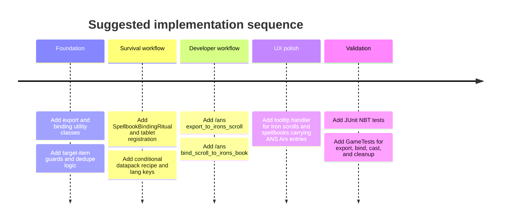

# Enabling Ars Nouveau Spell Export into Iron Spellbooks in Ars 'n Spells

> **Implementation status (3.0.0).** This research report predates the
> implementation; the shipped design diverges from its primary recommendation
> in one respect. The sidecar-on-real-Iron-items workflow it recommends WAS
> built (`ArsSpellExportUtil`, `IronsBookBindingUtil`, `SpellbookBindingRitual`,
> the Spell Loom, `/ans export_to_irons_scroll` / `bind_scroll_to_irons_book`),
> **and additionally** the proxy-`AbstractSpell` path this report rates "not
> recommended as primary" was implemented as the wheel-integration layer: a
> fixed pool of 8 pre-registered proxy spells (`ars_cross_1..8`,
> `ArsCrossProxyRegistry`/`ArsCrossProxySpell`) sidesteps the dynamic-registration
> and duplicate-rejection objections below, because each bound Ars spell claims
> a distinct registered proxy id. The sidecar remains the source of truth for
> casting; the proxy entry only provides native wheel presence. Consequence of
> the fixed pool: **at most 8 Ars spells per spellbook can appear in Iron's
> wheel** (`CrossCastNbt.PROXY_POOL_SIZE`). The report's warning about
> Inscription-Table/UI transfer semantics still stands and is covered by the
> `-PwithIronsRuntimeGameTests` gametest suite plus manual verification before
> release.

## Executive summary

The strongest conclusion from the current codebase is that **Ars 'n Spells already has the right core abstraction for arbitrary Ars Nouveau spells, and Iron’s native spellbook container does not**. In `otectus/ars-n-spells`, Ars spells are treated as **serialized, recipe-like payloads**: `ArsSerializedSpellDescriptor` stores a full `Spell` NBT subcompound, because Ars spells are not stable registry entries in the way Iron spells are. By contrast, Iron’s scrolls and spellbooks are built on `ISpellContainer` and `SpellContainer`, which store **registered `AbstractSpell` ids plus integer levels** inside `ISB_Spells`; they are not designed to hold an arbitrary upstream spell graph. citeturn9view0turn13view0turn24view0turn25view0

Because of that mismatch, the **ideal implementation is not “true native insertion” into Iron’s `ISB_Spells` container** for arbitrary Ars spells. The ideal implementation for this repository is a **hybrid, ANS-owned sidecar model on real Iron items**: export an Ars spell into a real `irons_spellbooks:scroll` carrier by writing the existing `arsnspells:cross_spells` payload to that item, then add that same payload to a real Iron spellbook by appending another ANS sidecar entry to the book’s root NBT. This preserves Ars spell fidelity, reuses the repo’s existing casting pipeline, keeps the on-disk format backward-compatible, and avoids trying to pretend a dynamic Ars recipe is a native Iron registry spell. citeturn10view0turn11view0turn14view0turn35view0

That recommendation is also the best fit for the current repo structure. The mod already has a `SpellTranscriptionRitual` that classifies source items, reads Ars or Iron spell sources, and stamps a `arsnspells:cross_spells` list onto a target item. It already supports multiple inscriptions per item, a selected index, server-authoritative validation, translated feedback, and plain JUnit tests for NBT round-trips. Extending that architecture is lower-risk than attempting a deep, native Iron spellbook integration. citeturn11view2turn12view0turn10view0turn13view1turn35view0turn35view1

If “native Iron spellbook slot insertion” is treated as a hard requirement, the only viable route is a **proxy-`AbstractSpell` architecture**, but it is architecturally weak for this use case. Iron’s container API expects registered spells, and `SpellContainer.addSpellAtIndex` rejects duplicates of the same spell object in one container. A single generic “Ars proxy spell” therefore cannot represent multiple distinct Ars recipes in one spellbook, while dynamically registering one new Iron spell per player-authored Ars recipe is not compatible with the documented registry model. That makes native-slot insertion a poor primary design, and at most a limited experimental path. citeturn25view0turn37view0turn34search0

## Assumptions and source baseline

This report assumes the **Forge 1.20.1** line of Ars ’n Spells, because the repository README and Gradle metadata target Minecraft `1.20.1`, Forge `47.2.0`, Java `17`, Ars Nouveau `4.12.7`, and Iron’s Spellbooks `3.15.x` on that branch. The public CurseForge page also states that the 1.20.1 Forge build remains supported alongside the newer 1.21.1 NeoForge line. citeturn4search0turn17view1turn17view2turn5search1

I also assume that “add it to an Iron spellbook” can mean one of two things. The first meaning is **native Iron container insertion**, where the spell becomes a normal `ISB_Spells` entry and participates in Iron’s own spellbook UI and casting flow. The second meaning is **attach the Ars spell to a real Iron spellbook item** so that the book carries and casts it through Ars ’n Spells’ cross-cast pipeline. The evidence strongly supports the second meaning as the robust implementation target for this repo. citeturn24view0turn25view0turn10view0turn11view0

Some Iron documentation publicly specifies gameplay behavior but not all internal transfer hooks. The official wiki states that the **Inscription Table** is used to slot spells from scrolls into spell books, and that the **Scroll Forge** crafts scrolls from ink, paper, and a focus, but the public materials located for this report do not fully specify the 1.20.1 internal code path that copies data from scroll root NBT into book root NBT during inscription. Where that exact behavior matters, I mark it as **unspecified from the located public sources** rather than guessing. citeturn37view1turn38view0

The evidence base for the analysis is primarily the public `otectus/ars-n-spells` repository, official Iron wiki pages and source, official/public Ars documentation and source, and Forge documentation on registries, items, and GameTests. Iron’s repository license also explicitly allows writing addon code against the mod as a dependency, while forbidding redistribution of Iron assets, which matters for deciding whether to use real Iron items instead of shipping lookalike assets. citeturn36view0turn23search0turn30search1turn33view0turn34search0turn34search8

| Assumption | Basis | Impact on recommendation |
|---|---|---|
| Target runtime is Forge 1.20.1, not the newer NeoForge 1.21.1 line | README and Gradle metadata pin the main 1.20.1 branch to Forge `47.2.0`, Java `17`, Ars `4.12.7`, Iron’s `3.15.x`. citeturn4search0turn17view1turn17view2 | The proposed plan avoids 1.21-only data-component assumptions and stays NBT-first. |
| Ars spells must preserve exact recipe fidelity | ANS intentionally stores Ars as serialized spell NBT rather than as a registry pointer. citeturn9view0turn13view0 | Favors ANS sidecar storage over native Iron slot insertion. |
| Iron spellbooks/scrolls are registry-slot containers | `ISpellContainer` and `SpellContainer` use spell ids, levels, lock flags, and indexes. citeturn24view0turn25view0 | Native insertion of arbitrary Ars spells is structurally mismatched. |
| Iron asset redistribution should be avoided | Iron’s repo allows addon dependencies but disallows redistributing assets. citeturn36view0 | Using real Iron items is better than making an Iron-lookalike ANS item. |

## Current Ars 'n Spells architecture

The relevant code in `otectus/ars-n-spells` is concentrated in the `spell`, `rituals`, `compat`, `registry`, `network`, `commands`, and test packages. The `spell` package already contains the cross-cast descriptors and validators; the `rituals` package already contains transcription and uninscription logic; the `registry` package already registers Iron-dependent ritual tablet items conditionally; and the test tree already has both JUnit coverage and a GameTest scaffold for the cross-cast pipeline. citeturn6view0turn7view0turn8view0turn18view0turn39view1turn16view0turn16view1turn42view0

### Spell representation and serialization

The repo’s abstraction is explicit: `SpellDescriptor` is a sealed interface whose implementations adapt the two upstream spell systems. `ArsSerializedSpellDescriptor` stores a `ResourceLocation spellId` plus a full `CompoundTag arsSpellTag`, and its own comment states that Ars spells are “recipe-like” and therefore the descriptor carries the full serialized form rather than a registry pointer. `IronsRegistrySpellDescriptor`, by contrast, stores a registered Iron spell id, level, and optional cast source string. That is the architectural center of gravity for this feature request. citeturn13view0turn9view0turn12view3

The on-item cross-cast schema is also already stable and test-backed. `CrossCastNbt` stores a root-level `arsnspells:cross_spells` list, where each entry can contain `spell_id`, `spell_level`, `spell_type`, optional `ars_spell`, and optional `cast_source`. The selected spell index is tracked separately in `arsnspells:cross_spell_index`. ANS’ tests verify that this sidecar can be added and then removed without disturbing unrelated root NBT, which is especially important for coexisting with Iron’s own `ISB_Spells` root key on the same item. citeturn10view0turn35view0

The current helper `CrossCastingHandler.addCrossModSpell(ItemStack, Spell)` already defines the repo’s present Ars serialization policy: it stores the spell under `CrossSpellType.ARS_NOUVEAU`, uses `ars_nouveau:spell` as the placeholder id, assigns `spell_level = 1`, and writes `spell.serialize()` into the `ars_spell` subcompound. That is a critical detail: **there is no native ANS notion of “Iron level” for an Ars spell**. Level `1` is a placeholder, not a semantic conversion. citeturn14view0

### Item creation, rituals, and integration points

`SpellTranscriptionRitual` already performs nearly the kind of mutation this feature needs. It scans dropped item entities within a radius, classifies them with `InscriptionInputs`, reads a spell-bearing source, and writes a cross-cast payload onto the target item. It supports source items from Ars spell parchment, focus, or spellbook, and also from Iron scrolls. On success, the source is consumed and the target is rewritten in place with the new NBT. That means the core “take a source spell and write an ANS payload onto another item” pipeline is already implemented. citeturn11view2turn12view0turn12view2

The ritual subsystem was also written with optional-Iron safety in mind. `InscriptionInputs` delegates Iron-only parsing to `IronsInscriptionReader` so that Iron classes are never loaded on Iron-less servers, and `IronsCompat.isLoaded()` centralizes the loader check. `ModItemsRegistry` registers the transcription tablet only when Iron’s is present, while the uninscription tablet is always present so legacy items can still be cleaned up after uninstalling Iron’s. Any new implementation should follow that exact classloading pattern. citeturn12view0turn12view2turn17view0turn19view0turn39view1

The existing ritual recipes are also conditional and survival-friendly. `spell_transcription.json` is wrapped in `forge:conditional` so it only loads if `irons_spellbooks` is present, while `spell_uninscription.json` is unconditional. This is the right datapack pattern to reuse for any new “bind Ars scroll into Iron spellbook” station or ritual recipe. citeturn17view3turn22view0

### Casting path, permissions, and test hooks

The cross-cast runtime is server-authoritative. On right-click with an inscribed item, `CrossCastingHandler` intercepts `PlayerInteractEvent.RightClickItem`, sends a `CrossCastRequestPacket` from the client, re-reads the stack server-side, validates the selected payload with `CrossCastValidator`, and then dispatches by `CrossSpellType`. For Ars entries, it reconstructs the spell from the stored `ars_spell` tag and casts it through `SpellCaster.castSpell(...)`; for Iron entries, it resolves the registered spell id and calls Iron’s `attemptInitiateCast(...)`. This is exactly why ANS can safely preserve Ars spells as opaque payloads instead of forcing a lossy translation. citeturn10view1turn11view0turn13view1turn14view1

The repo already supports **multiple inscriptions per item** and in-place cycling, because the sidecar is a list, not a single slot. `CrossCastNbt.addCrossModSpellToTag(...)` appends entries, and `CrossCastingHandler.serverHandleCast(...)` cycles `arsnspells:cross_spell_index` when the action is `CYCLE`. That makes an Iron spellbook-root sidecar especially attractive: you do not need Iron’s native slot model to hold multiple Ars exports on the same book, because ANS already has a multi-entry list model. citeturn10view0turn11view0turn14view0

The repo is also already prepared for safe extension. `ArsNSpells.java` conditionally registers Iron-specific handlers, the command tree is centralized in `ArsNSpellsCommands.java`, and the test setup includes plain JUnit tests for NBT contracts plus a Forge GameTest scaffold wired through `runGameTestServer`. That makes it realistic to add a conversion workflow without changing the project’s testing philosophy or registration style. citeturn39view1turn40view0turn17view1turn43view0

## Iron’s model and the schema mismatch

Iron’s data model is meaningfully different from Ars ’n Spells’ Ars path. The public API interface `ISpellContainer` is centered on `AbstractSpell` objects and integer levels. It exposes `addSpellAtIndex(AbstractSpell spell, int level, int index, boolean locked, ItemStack itemStack)`, `addSpell(...)`, `removeSpell(...)`, and helper constructors such as `createScrollContainer(...)` and `createImbuedContainer(...)`. In other words, Iron scrolls and spellbooks are not “arbitrary payload holders”; they are typed containers for Iron registry spells. citeturn24view0

That model is confirmed by `SpellContainer.serializeNBT()`. Iron stores its container at the root key `ISB_Spells`, with fields such as `maxSpells`, `mustEquip`, `spellWheel`, and a `data` list. Each slot entry stores `id`, `level`, `locked`, and `index`. This is a very different schema from ANS’ `arsnspells:cross_spells` list, where Ars entries carry a full `ars_spell` blob. Iron’s schema simply has no first-class field for a serialized foreign spell graph. citeturn25view0

The gameplay-facing docs line up with that source layout. The official Iron wiki says the **Inscription Table** “slots spells from scrolls into spell books for repeated use,” while the **Scroll Forge** crafts scrolls from ink, paper, and a focus, with the ink determining rarity and therefore item level. The progression page says spellbooks are populated by bringing scrolls to the Inscription Table. That is a content pipeline for **registered Iron spells with levels and rarities**, not for arbitrary player-authored Ars recipes. citeturn37view1turn38view0

Iron’s casting path also expects a real `AbstractSpell`. `Scroll.use(...)` resolves the contained spell through `ISpellContainer.get(itemStack).getSpellAtIndex(0)` and then calls `spell.attemptInitiateCast(..., CastSource.SCROLL, ...)`. `SpellBook` tooltips read active spells from `ISpellContainer` and present them as discrete spell entries. `AbstractSpell.attemptInitiateCast(...)` and `castSpell(...)` are the backbone of the permission, mana, and cooldown model. That is why merely writing foreign metadata onto a native Iron slot compound is not enough; a real `AbstractSpell` instance has to exist. citeturn26view0turn26view1turn28view0

The current public developer docs for Iron reinforce the same boundary. The official developer page documents spell registration via a `DeferredRegister<AbstractSpell>` and `SpellRegistry.SPELL_REGISTRY_KEY`. That is the correct model for addon-defined spells, but it does not provide a documented way to create new registered spells dynamically at gameplay time for each unique player-authored Ars recipe. citeturn37view0turn34search0

### What is specified and what remains unspecified

Several things are specified clearly enough to build against. It is specified that Iron containers are item-root NBT under `ISB_Spells`, that `AbstractSpell` ids and levels are the core stable representation, that scrolls and spellbooks operate through `ISpellContainer`, and that addon authors can register custom `AbstractSpell` implementations through Iron’s registry. citeturn24view0turn25view0turn26view0turn26view1turn37view0

What is **not** fully specified by the public materials located for this report is the exact 1.20.1 implementation detail of the **Inscription Table’s internal transfer behavior** when moving data from a scroll into a book. The public wiki states what the block does, but I did not locate a cited public source in this research set that shows whether that path copies only `SpellData`/`ISB_Spells`, or also preserves arbitrary source-item root siblings. For that reason, any design that depends on the native Inscription Table preserving ANS sidecar metadata should be treated as **unspecified and risky** until confirmed in source or by test. citeturn37view1turn38view0

## Mapping analysis

The following table shows the structural mapping between the current Ars ’n Spells Ars representation and Iron’s native schema.

| Concept | Ars / ANS current representation | Iron native representation | Safe mapping? | Notes |
|---|---|---|---|---|
| Spell identity | Placeholder `spell_id` plus full serialized `ars_spell` subcompound in ANS sidecar. citeturn9view0turn10view0 | `id` of a registered `AbstractSpell` in `ISB_Spells.data[*]`. citeturn24view0turn25view0 | **No direct one-to-one mapping** | Ars spell identity is recipe-stateful; Iron identity is registry-stateful. |
| Spell body | Opaque serialized `Spell` blob, reconstructed with `Spell.fromTag(...)`. citeturn9view0turn11view0 | No equivalent body field in `SpellContainer`; only spell id + level. citeturn25view0 | **No** | Native Iron slots cannot natively store an arbitrary foreign spell graph. |
| Level | Current ANS helper writes `spell_level = 1` for Ars entries. citeturn14view0 | Integer `level` is fundamental to spell rarity/power and slot data. citeturn24view1turn25view0turn37view1 | **Not semantically aligned** | Ars does not expose a canonical Iron-style spell level in current ANS code. |
| Cast source | Optional `cast_source` string on Iron entries in ANS sidecar. citeturn10view0turn12view3 | `CastSource` enum such as `SPELLBOOK`, `SCROLL`, `SWORD`, `COMMAND`. citeturn24view2turn28view0 | **Yes, if ANS remains dispatcher** | Useful metadata when ANS invokes Iron; less useful for Ars payloads. |
| Display name | `displayName()` is currently placeholder-centric; Ars may fall back to literal id or “Ars Spell.” citeturn9view0turn12view3 | `SpellData.getDisplayName()` is derived from the contained `AbstractSpell`. citeturn24view1 | **Only with custom tooltip/name code** | ANS should compute display text from the Ars recipe string or custom name. |
| Multiple spells on one item | Supported by `arsnspells:cross_spells` list plus selected index. citeturn10view0turn11view0 | Supported by `ISB_Spells.data[*]`, but duplicate spell objects are rejected by `addSpellAtIndex`. citeturn25view0 | **ANS sidecar: yes; native proxy: limited** | A single generic proxy spell cannot appear multiple times in one book. |
| Validation | `CrossCastValidator` checks presence, type, id shape, level, and non-empty Ars payload. citeturn13view1turn35view1 | Iron resolves `AbstractSpell` and casts through `canBeCastedBy(...)` / `attemptInitiateCast(...)`. citeturn28view0 | **Yes, in a layered model** | Keep ANS validation first, then defer to upstream runtime checks. |

The implication is straightforward: **there is no clean native field mapping from an arbitrary Ars spell to a native Iron slot entry**. The only fully faithful mapping is to keep the Ars spell as an ANS-owned opaque blob and attach that blob to an item that players recognize as part of the Iron workflow. citeturn9view0turn10view0turn24view0turn25view0

That same conclusion answers the “scroll” question. If the goal is a user-facing scroll item, the safest interpretation is **“a real Iron scroll item carrying an ANS sidecar payload”**, not “a native Iron scroll container entry that somehow encodes an Ars spell.” The first approach is compatible with the current repo and with Iron’s asset/license boundaries; the second approach requires either proxy spells or undocumented transfer hooks. citeturn26view0turn36view0

## Design options and recommendation

There are four realistic workflow families.

| Option | User workflow | Fit with current repo | Main risks | Verdict |
|---|---|---|---|---|
| **Extend ANS sidecar onto real Iron items** | Export Ars spell onto a real `irons_spellbooks:scroll`, then bind that payload onto a real Iron spellbook; cast through ANS cross-cast. citeturn11view2turn10view0turn11view0 | Excellent; reuses `SpellTranscriptionRitual`, `CrossCastNbt`, `CrossCastingHandler`, and sidecar preservation tests. citeturn11view2turn10view0turn35view0 | Not visible in native Iron spellbook slot UI unless extra tooltip/UI work is added. | **Recommended** |
| **Native Iron proxy spell insertion** | Convert Ars spell into a proxy `AbstractSpell`, then store it in `ISB_Spells` like any normal Iron spell. citeturn24view0turn25view0turn37view0 | Weak; requires new registered spells for dynamic content. | Registry mismatch, duplicate rejection, likely poor multi-spell behavior, uncertain Inscription Table transfer semantics. citeturn25view0turn37view0 | **Not recommended as primary path** |
| **Command or admin API only** | `/ans` command exports current Ars spell to a carrier scroll or directly to a held spellbook. citeturn40view0 | Very easy; commands already exist. | Poor survival UX; not discoverable for players. | **Good as a secondary tool** |
| **Custom GUI first** | Open a custom export/bind screen, choose source spell and target book visually, then write ANS sidecar. | Possible, but current repo is ritual-first rather than screen-first. citeturn11view2turn19view0 | Higher implementation cost: screens, menus, packets, sync, and more client compatibility work. | **Phase-two enhancement** |

The best overall approach is a **hybrid ritual-first implementation with command-based developer hooks**. Specifically, I recommend: export Ars spells to real Iron scroll carriers using ANS sidecar NBT; add a dedicated ANS “bind to spellbook” workflow that consumes that scroll and appends the same sidecar entry to a real Iron spellbook; preserve casting through the existing ANS server-authoritative `CrossCastingHandler`; and improve usability with tooltips and explicit messages rather than pursuing native Iron slot insertion. That recommendation is rigorous because it matches the repo’s existing abstractions instead of fighting them. citeturn11view2turn10view0turn11view0turn40view0

The core data flow for the recommended design looks like this:


That flow is a direct synthesis of the current transcription, validation, packet, and cast code paths already present in the repo. citeturn11view2turn12view0turn10view0turn11view0turn13view1

## Implementation plan and developer instructions

The implementation should be done in a way that **does not change the core ANS schema** and **does not add unconditional Iron class references** to common-side classes. Keep the existing `arsnspells:cross_spells` sidecar format exactly as-is for spell payloads; add only optional metadata if you really need UI hints. That preserves backward compatibility with already-inscribed items and aligns with the existing comment in `SpellDescriptor` that the on-disk shape stays unchanged so older items round-trip cleanly. citeturn13view0turn10view0

### Concrete code changes

The most coherent implementation is this set of changes:

1. **Add a dedicated export/bind utility layer** in `src/main/java/com/otectus/arsnspells/spell/`.
   - Add `ArsSpellExportUtil.java`.
   - Add `IronsBookBindingUtil.java`.
   - Keep both utility classes free of unconditional top-level Iron imports; follow the `IronsInscriptionReader` pattern by isolating Iron-only code behind guarded helper classes. citeturn12view2turn17view0

2. **Extend the ritual workflow** in `src/main/java/com/otectus/arsnspells/rituals/`.
   - Keep `SpellTranscriptionRitual.java` for Ars-source → carrier-item export.
   - Add `SpellbookBindingRitual.java` for carrier-scroll → Iron spellbook binding.
   - Add a new `SpellbookBindingInputs.java` if you want a simpler classifier than overloading `InscriptionInputs`. This keeps the existing transcription semantics stable and avoids overfitting one classifier to two different rituals. citeturn11view2turn12view0

3. **Register the new ritual tablet conditionally**.
   - Modify `src/main/java/com/otectus/arsnspells/registry/ModItemsRegistry.java`.
   - Keep the new binding tablet in the Iron-dependent registration path, for the same reason the existing transcription tablet is conditional. citeturn19view0

4. **Add a developer/admin command path**.
   - Extend `src/main/java/com/otectus/arsnspells/commands/ArsNSpellsCommands.java`.
   - Suggested subcommands:
     - `/ans export_to_irons_scroll`
     - `/ans bind_scroll_to_irons_book`
   - Gate both behind permission level `2`, matching the current command style. citeturn40view0

5. **Add tooltip and display polish**.
   - Add `src/main/java/com/otectus/arsnspells/events/CrossSpellTooltipHandler.java`.
   - When an item is a real Iron scroll or spellbook and contains ANS Ars entries, append translated tooltip lines such as:
     - “Embedded Ars spell”
     - spell display string
     - active index / total count
     - “Right-click to cast, sneak-right-click to cycle”
   - Localization belongs in `src/main/resources/assets/ars_n_spells/lang/en_us.json`, beside the existing ritual and command keys. citeturn21view0

6. **Add datapack recipes**.
   - Keep the existing transcription recipe untouched unless you want different reagents.
   - Add `src/main/resources/data/ars_n_spells/recipes/apparatus/spellbook_binding.json`.
   - Wrap it in `forge:conditional` with `mod_loaded = irons_spellbooks`, like the existing transcription recipe. citeturn17view3

7. **Add tests in both JUnit and GameTest layers**.
   - JUnit:
     - `src/test/java/com/otectus/arsnspells/spell/ArsToIronsCarrierNbtTest.java`
     - `src/test/java/com/otectus/arsnspells/spell/IronsBookBindingNbtTest.java`
     - `src/test/java/com/otectus/arsnspells/spell/ArsExportDeduplicationTest.java`
     - `src/test/java/com/otectus/arsnspells/rituals/SpellbookBindingPredicateTest.java`
   - GameTest:
     - `src/main/java/com/otectus/arsnspells/gametest/ArsIronsExportGameTests.java`
   - Follow the repo’s existing style: keep NBT contract tests Bootstrap-free when possible, and use GameTests only for runtime/integration assertions. citeturn35view0turn35view1turn35view2turn43view0turn34search2

### Recommended function surface

These are the function-level additions I recommend for clarity and testability:

```java
// src/main/java/com/otectus/arsnspells/spell/ArsSpellExportUtil.java
public final class ArsSpellExportUtil {
    public static Optional<Spell> extractArsSpell(ItemStack stack);
    public static ItemStack createIronsScrollCarrier(Spell arsSpell);
    public static CompoundTag serializeArsSpell(Spell arsSpell);
    public static String buildDisplayLabel(Spell arsSpell);
}

// src/main/java/com/otectus/arsnspells/spell/IronsBookBindingUtil.java
public final class IronsBookBindingUtil {
    public static boolean isIronsScroll(ItemStack stack);
    public static boolean isIronsSpellBook(ItemStack stack);
    public static boolean containsEquivalentArsSpell(ItemStack stack, CompoundTag arsTag);
    public static boolean appendArsSpellToBook(ItemStack spellbook, CompoundTag arsTag);
    public static Optional<CompoundTag> extractSingleArsEntry(ItemStack carrierScroll);
}
```

These utilities keep all low-level mutation out of the ritual class bodies, which makes them much easier to cover with the same style of **CompoundTag-only tests** already used by `CrossCastNbtRoundTripTest` and `CrossCastValidatorTest`. citeturn35view0turn35view1

### Recommended annotated implementation steps

A developer can follow this sequence directly:

1. **Add `ArsSpellExportUtil.extractArsSpell(ItemStack)`** by reusing the same source-reading logic already used by `InscriptionInputs.readSource(...)`. If the result is not `CrossSpellType.ARS_NOUVEAU`, reject it. This prevents divergence between export behavior and ritual source parsing. citeturn12view0turn12view1

2. **Create a carrier scroll on a real Iron scroll item**. Resolve the item registry entry for `irons_spellbooks:scroll` only when `IronsCompat.isLoaded()` is true, create an `ItemStack`, and call the existing `CrossCastingHandler.addCrossModSpell(stack, spell)` helper. Then set a hover name and add optional ANS-only cosmetic metadata if desired. Do **not** attempt to create a native `ISB_Spells` entry for the Ars spell. citeturn17view0turn14view0turn24view0

3. **Bind from carrier scroll to spellbook by copying the ANS sidecar entry**, not by opening Iron’s `ISB_Spells` container. The shortest safe path is to extract the single `arsnspells:cross_spells[0]` entry from the carrier scroll and append it onto the target spellbook’s root with `CrossCastNbt.addCrossModSpellToTag(...)`. Because ANS tests already verify that its sidecar preserves unrelated root NBT, this safely coexists with the spellbook’s existing `ISB_Spells`. citeturn10view0turn35view0

4. **Deduplicate by serialized Ars payload**, not by placeholder id. Every exported Ars spell will likely use the same placeholder `spell_id` (`ars_nouveau:spell`), so dedupe logic must compare the `ars_spell` subcompound, not just `spell_id`. This is a direct consequence of the current `addCrossModSpell(ItemStack, Spell)` helper. citeturn14view0

5. **Expose a ritual path for survival players**. `SpellbookBindingRitual` should require exactly one exported carrier scroll and exactly one Iron spellbook in range, validate fully before mutation, append the sidecar entry to the book, consume the scroll, and show translated feedback following the current ritual style. citeturn11view2turn21view0

6. **Expose command hooks for testing and ops**. Add two `/ans` subcommands so you can generate an exported carrier scroll or bind it directly without setting up a ritual every time. This is useful for multiplayer administration and for automated verification. citeturn40view0

7. **Improve discoverability with tooltips**. Because a bound Ars spell will not appear in Iron’s native spellbook slot UI, tooltip text is the minimum required UX affordance. Show the selected Ars entry and the count of ANS-bound entries on the book. citeturn10view0turn21view0

### Example code snippet

This example shows the core mutation path for the recommended design.

```java
package com.otectus.arsnspells.spell;

import com.hollingsworth.arsnouveau.api.spell.Spell;
import com.otectus.arsnspells.compat.IronsCompat;
import net.minecraft.nbt.CompoundTag;
import net.minecraft.network.chat.Component;
import net.minecraft.resources.ResourceLocation;
import net.minecraft.world.item.Item;
import net.minecraft.world.item.ItemStack;
import net.minecraftforge.registries.ForgeRegistries;

import java.util.Optional;

public final class ArsSpellExportUtil {
    private static final ResourceLocation IRONS_SCROLL_ID =
            new ResourceLocation("irons_spellbooks", "scroll");

    private ArsSpellExportUtil() {}

    public static ItemStack createIronsScrollCarrier(Spell arsSpell) {
        if (!IronsCompat.isLoaded()) {
            return ItemStack.EMPTY;
        }

        Item item = ForgeRegistries.ITEMS.getValue(IRONS_SCROLL_ID);
        if (item == null || arsSpell == null) {
            return ItemStack.EMPTY;
        }

        ItemStack out = new ItemStack(item);
        CrossCastingHandler.addCrossModSpell(out, arsSpell);

        // Cosmetic only; casting still keys off ANS sidecar NBT.
        out.setHoverName(Component.translatable("item.ars_n_spells.transcribed_ars_scroll"));
        out.getOrCreateTag().putString("arsnspells:export_mode", "irons_scroll_carrier");
        return out;
    }

    public static Optional<CompoundTag> serializeForBinding(Spell arsSpell) {
        if (arsSpell == null) {
            return Optional.empty();
        }
        CompoundTag tag = arsSpell.serialize();
        return tag.isEmpty() ? Optional.empty() : Optional.of(tag);
    }
}
```

The important part is not the cosmetics; it is that the code continues to use the existing ANS sidecar helper `CrossCastingHandler.addCrossModSpell(...)` instead of inventing a second Ars export format. That keeps the casting and the storage model aligned. citeturn14view0turn10view0

### Example NBT and JSON shapes

The **current ANS sidecar shape** for an Ars spell entry looks like this conceptually:

```snbt
{
  "arsnspells:cross_spells": [
    {
      "spell_type": "ARS_NOUVEAU",
      "spell_id": "ars_nouveau:spell",
      "spell_level": 1,
      "ars_spell": {
        "...": "opaque upstream Ars spell payload"
      }
    }
  ],
  "arsnspells:cross_spell_index": 0
}
```

That shape is directly based on `CrossCastNbt` and the current Ars helper method in `CrossCastingHandler`. The inner `ars_spell` compound should be treated as **opaque upstream-owned data** and copied verbatim. citeturn10view0turn14view0turn9view0

A **native Iron spell container** looks conceptually like this:

```snbt
{
  "ISB_Spells": {
    "maxSpells": 3,
    "mustEquip": true,
    "spellWheel": true,
    "data": [
      {
        "id": "irons_spellbooks:fireball",
        "level": 3,
        "locked": false,
        "index": 0
      }
    ]
  }
}
```

That schema comes from `SpellContainer.serializeNBT()`. It is useful as a coexistence constraint, but not as the primary storage target for an exported Ars spell. citeturn25view0

A **bound Iron spellbook using the recommended hybrid model** would simply carry both at once:

```snbt
{
  "ISB_Spells": {
    "maxSpells": 3,
    "mustEquip": true,
    "spellWheel": true,
    "data": [
      {
        "id": "irons_spellbooks:fireball",
        "level": 3,
        "locked": false,
        "index": 0
      }
    ]
  },
  "arsnspells:cross_spells": [
    {
      "spell_type": "ARS_NOUVEAU",
      "spell_id": "ars_nouveau:spell",
      "spell_level": 1,
      "ars_spell": {
        "...": "opaque upstream Ars spell payload"
      }
    }
  ],
  "arsnspells:cross_spell_index": 0
}
```

That coexistence is exactly what the ANS NBT preservation tests make safe: ANS adds and clears only its own root keys and preserves unrelated sibling data. citeturn10view0turn35view0

A **new ritual recipe** can follow the same pattern already used by the repo:

```json
{
  "type": "forge:conditional",
  "recipes": [
    {
      "conditions": [
        { "type": "forge:mod_loaded", "modid": "irons_spellbooks" }
      ],
      "recipe": {
        "type": "ars_nouveau:enchanting_apparatus",
        "keepNbtOfReagent": false,
        "output": { "item": "ars_n_spells:spellbook_binding" },
        "reagent": [
          { "item": "ars_n_spells:spell_transcription" }
        ],
        "pedestalItems": [
          { "item": "irons_spellbooks:spell_book" },
          { "item": "irons_spellbooks:scroll" },
          { "item": "ars_nouveau:source_gem_block" }
        ],
        "sourceCost": 2500
      }
    }
  ]
}
```

That example is intentionally modeled after the existing conditional transcription recipe pattern in the repo. citeturn17view3

The implementation sequence below keeps the work ordered without depending on native Iron slot internals:



## Compatibility, migration, and edge cases

A major advantage of the recommended design is that **migration is almost trivial**. Because it reuses the existing `arsnspells:cross_spells` format, already-inscribed items remain valid, and no old ANS item needs to be rewritten into a new schema. If you add new optional metadata, put it in a new ANS-owned sibling key or compound; do not change the shape of existing spell entries. That preserves the compatibility guarantee already documented in the descriptor layer. citeturn13view0turn10view0

Compatibility with Iron-less installs must be treated as a first-class requirement. The repo already has careful patterns for this: `IronsCompat.isLoaded()` caches the mod-presence check; `IronsInscriptionReader` isolates Iron imports; and Iron-specific items and handlers are registered only when the mod is loaded. New export and binding code should follow the same model, especially if you add any helpers for recognizing Iron scrolls or spellbooks. citeturn17view0turn12view2turn19view0turn39view1

The most important edge case is **duplicate Ars entries**. Since all exported Ars entries currently share the same placeholder `spell_id`, duplicate detection must be based on the serialized `ars_spell` payload, not the placeholder id. If two carriers or books have equal `ars_spell` compounds, treat them as the same exported spell unless the design explicitly wants duplicates. citeturn14view0turn9view0

Another important edge case is **book UX confusion**. In the recommended model, an exported Ars spell in an Iron spellbook will not automatically become a native `ISB_Spells` slot entry, so it will not behave exactly like a normal Iron-inscribed spell in every UI surface. The minimum viable mitigation is a tooltip and action-bar language layer that makes the distinction obvious: ANS-bound Ars entries are cast through ANS, while Iron-inscribed entries are cast through Iron. If exact spell-wheel parity becomes necessary later, that should be a second phase with a dedicated client UX design rather than a rushed proxy insertion. citeturn26view1turn10view0turn21view0

A third edge case is **source ambiguity**. `InscriptionInputs.readSource(...)` currently accepts both Ars-bearing items and Iron spell containers. For the new spellbook-binding phase, do not infer too much from a generic source classifier. Binding should require a clearly recognized **carrier scroll with exactly one Ars entry**, or it should fail with a translated error instead of trying to guess which entry to copy. That matches the repo’s current ritual philosophy of complete validation before mutation. citeturn12view0turn11view2

Finally, the design should deliberately avoid relying on undocumented or unstable upstream behavior. The official Iron docs clearly support **registered custom spells** and **spell container manipulation**, but they do not document a dynamic, per-player foreign-spell insertion workflow. Forge’s registry model likewise expects registration through the normal mod lifecycle, not gameplay-time mutation of the spell registry. Staying within the ANS sidecar model therefore is not just simpler; it is the option most aligned with the documented extension boundaries of both upstream mods and Forge itself. citeturn37view0turn34search0turn24view0

In practical terms, the concise developer instruction is this: **treat exported Ars spells as ANS-owned opaque payloads attached to real Iron items, not as native Iron slot spells**. Reuse `CrossCastNbt`, reuse `CrossCastingHandler.addCrossModSpell(...)`, add one new binding ritual and a pair of `/ans` helper commands, preserve classloading guards, and add tooltip/test coverage. That is the most rigorous, lowest-risk, and most codebase-native way to give players an Ars-to-Iron scroll-to-spellbook workflow in `otectus/ars-n-spells`. citeturn10view0turn14view0turn11view2turn40view0turn35view0turn43view0