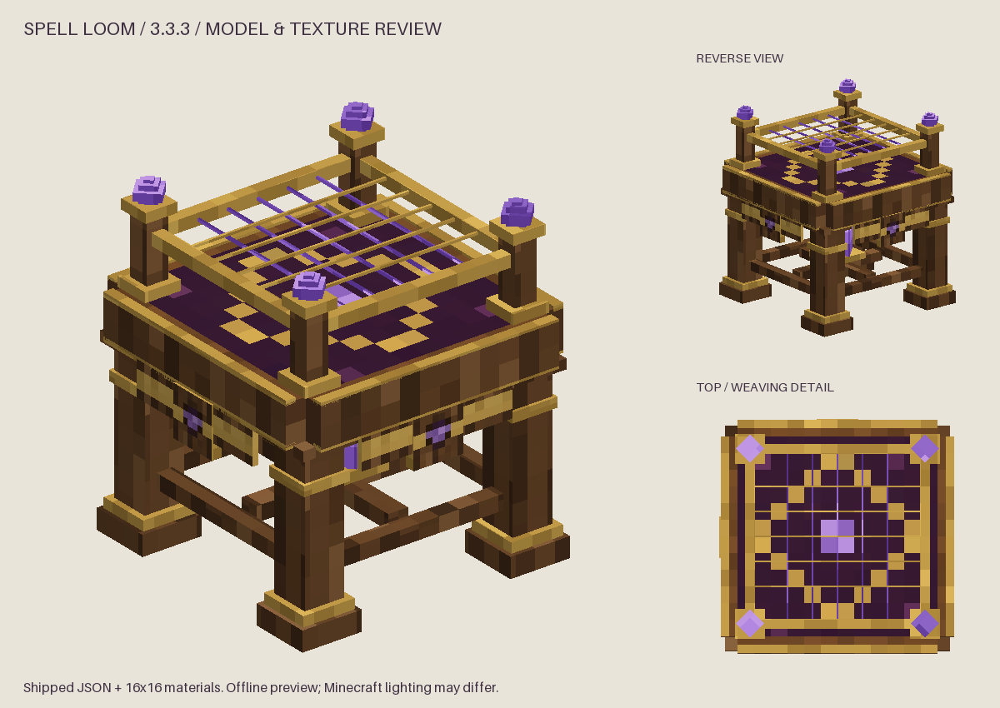

# Spell Loom visual update — NeoForge 3.3.3

The NeoForge 1.21.1 Loom uses the same final model and textures as Forge: 91
cuboids, 546 faces, 16×16 Minecraft-style materials, a complete gold diamond,
and an open wire mesh with all ten threads. The purple cloth square is removed.

The cached collision/selection shape uses the same 26 boxes as Forge, adapted to
NeoForge's protected `getShape` override. The registry uses `noOcclusion()` for
the open frame. Native NeoForge menu, block entity and inventory handling remain
in place. The release version is 3.3.3.

## Backup

[Prior NeoForge Loom](../../backups/spell-loom/spell-loom-before-art-port-20260912T233810Z.zip) preserves the previous files with
repository-relative paths. Its manifest records SHA-256 hashes and newly added
paths. The ZIP and every archived hash are verified before any files are replaced.

## Assets and tooling

- Model: `src/main/resources/assets/ars_n_spells/models/block/spell_loom.json`.
- Textures: `src/main/resources/assets/ars_n_spells/textures/block/spell_loom_*.png`.
- Geometry: `python3 tools/generate_spell_loom.py`.
- Preview: `python3 tools/preview_spell_loom.py` (Pillow and NumPy).
- Source atlas: [spell-loom-materials.png](spell-loom-materials.png).
- Corrected tabletop source: [spell-loom-top-repaired-source.png](spell-loom-top-repaired-source.png).
- Original tabletop edit prompt: [spell-loom-diamond-repair-prompt.txt](spell-loom-diamond-repair-prompt.txt).

The existing built-in imagegen artwork is copied byte-for-byte from Forge. The
six 16×16 PNGs are opaque RGB. The legacy `weave` material is retained at its
resource location but is not used by any face. There is no shader, animation or
new game dependency. The shared preview is an offline render; a live NeoForge
client visual check has not been run.

For texture regeneration, crop the 1536×1024 atlas into six 512×512 cells ordered
top/side/bottom then brass/crystal/weave and resize to 16×16 using nearest-neighbor
sampling. For the top texture, use the entire corrected 1254×1254 source instead
of the older atlas crop.

## Verification commands

`gradle --offline compileJava processResources test --tests com.otectus.arsnspells.registry.ItemAssetCompletenessTest jar`

The NeoForge artifact is `build/libs/ars_n_spells-3.3.3.jar`. Actual results are
recorded in `spell-loom-validation.json` after verification.

Validation passed: Java compilation, resource processing, 4 existing item-asset tests, JAR packaging, all nine packaged Loom resources, and Forge/NeoForge asset and collision-shape parity.

The checkout wrapper has CRLF line endings and cannot launch directly on Linux. Verification used the cached Gradle 8.12 distribution; the exact executable and command are recorded in `spell-loom-validation.json`.
