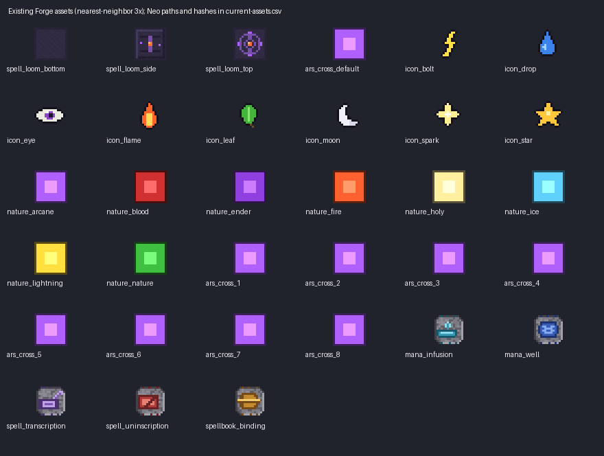

# Ars ’n Spells: compatibility audit and implementation specification

Audit date: **2026-09-05**. Deliverable: implementation instructions, not an implemented patch or certification of every modpack. Findings concern the pinned commits below. No tracked game source was changed during this audit.

Reading order: [scope/evidence](#1-decision-and-scope), [feature/loader matrices](#2-feature-and-integration-map), [27 verified findings](#3-verified-findings-and-implementation-tickets), [16 risks](#4-suspected-risks-and-incomplete-guarantees), [architecture](#5-target-architecture-one-compatibility-contract-versioned-adapters), [migration](#6-configuration-serialization-and-migration-plan), [enhancements](#7-product-refinement-and-coherent-expansion), [274-icon library](#8-icon-library-and-visual-specification), [testing](#9-testing-and-release-acceptance), [roadmap](#10-priorities-dependencies-and-phased-roadmap).

## 1. Decision and scope

Prioritize the casting transaction, mode transitions, NeoForge progression, inscription safety, and reliable integration tests before adding more mechanics. The project already has useful optional-mod gates, server-side inscription validation, proxy reconciliation helpers, bounded source scans, and substantial unit coverage. Those foundations are undermined by payment logic spread across cost queries, pre-cast hooks, on-cast events, mixins, and later effect resolution.

The two versions are **not behaviorally equivalent**. NeoForge improves damage attribution and multi-school analysis but loses parts of Forge’s cross-cast billing, gear policy, progression modifier identity, and addon mappings. Forge has broader Covenant integration, but that integration has unverified runtime assumptions and unsafe late payment paths. Matching class names and passing structural tests are insufficient evidence of parity.

### 1.1 Exact review targets

| Target | Branch and commit | ANS version | Build/runtime inspected |
|---|---|---|---|
| Forge 1.20.1 | `main`, `2578bad5d820fc2de9f38c26c92833a0d977c441` | 3.3.0 | Java 17, Forge 47.4.10; Ars 4.12.7; Iron’s jar file 7402504, internally **1.20.1-3.15.0** |
| NeoForge 1.21.1 | `port/neoforge-1.21.1`, `eb6d3af883b5386785e7e4d2793871f11f3830ce` | 3.2.5 | Java 21, NeoForge 21.1.248; Ars 5.13.1.1400; Iron’s 1.21.1-3.16.3 |

The branch SHAs were checked against GitHub during this audit. Review used isolated extracted snapshots, the local Forge checkout, dependency jars already present in the Gradle cache, selected decompiled upstream classes, source/resource inventories, fresh compilation/unit tasks, and headless GameTests. Dependency identities and SHA-256 hashes are in [dependency-evidence.csv](dependency-evidence.csv). Immutable source links throughout this document refer to these commits, not moving branch heads.

Forge: 141 main Java files, including GameTests, and 64 test-source files. NeoForge: 147 main Java files and 58 test-source files. Both have 63 main resource files. [source-inventory.csv](source-inventory.csv) inventories all source/resource files; inventory inclusion is not a claim that every line or every possible configuration was dynamically exercised.

### 1.2 Evidence vocabulary and severity

- **V-S — verified from source:** the implementation or mismatch is directly present and its relevant callers were traced. Reproduction instructions are acceptance scenarios unless explicitly marked executed.
- **V-R — observed at runtime:** reproduced in this audit’s recorded build or gameplay run. A failing test does not automatically establish a production defect.
- **R — suspected risk:** plausible failure requiring the named experiment; do not report it as a confirmed exploit or regression.
- **P — design proposal:** new policy, interface, content, or balance choice. Names in proposed pseudocode and JSON are ANS design contracts, not claims that an upstream API exists.
- **P0:** proven crash/data-corruption or severe exploit blocking ordinary supported play. **P1:** substantial correctness, item-loss, billing, or compatibility defect. **P2:** narrower correctness, UX, maintainability, performance, and test gaps. **P3:** polish/expansion. Priority can differ from severity for dependencies.
- Confidence **high** means direct source/trace or repeatable runtime evidence; **medium** means the implicated behavior is real but its precise practical impact depends on environment or event timing. No finding below is promoted to P0 merely from a hypothetical scenario.

This is a broad audit, not proof that no other defects exist. No graphical client session, real-player multiplayer session, full Covenant dependency stack, JEI/EMI client matrix, performance load test, or cross-Minecraft world conversion was completed. Those are explicit release gates below.

### 1.3 Executed validation

| Run | Result | Interpretation |
|---|---|---|
| Forge `compileJava`, then `test --rerun-tasks --offline --no-daemon` | **272 tests, 64 XML suites, zero failed/error/skipped** | Fresh unit/compile run; warnings remain. Does not prove actual casting economics. |
| NeoForge `compileJava test --offline --no-daemon` in snapshot | **312 tests, 57 XML suites, zero failed/error/skipped** | Java 21/API compilation succeeds. Source file count differs from executable test-suite count. |
| Forge loaded GameTests: Iron’s + Ars Elemental | **74 completed, 1 required failure** | Binding happy-path failure; shared configuration interference is a strong suspect, not a confirmed broken ritual for players. |
| NeoForge loaded GameTests: Iron’s + Elemental + Elemancy + Ars Zero | **71 completed, 4 required failures** | Two mismatched carrier fixtures, one synthetic-book cleanup failure, and binding failure; details in V26. |
| NeoForge default Iron’s-absent GameTests | **71 required tests passed** | Includes tests that call `succeed()` when their optional mod is absent; not 71 exercised integration paths. |
| Forge default run immediately after removing Iron’s from the loaded test world | **World failed to load; Gradle still printed BUILD SUCCESSFUL** | Missing upstream `irons_spellbooks:pocket_dimension_type`; existing-world removal differs from fresh absent-mod startup. Preserve backups. See R12 and evidence. |
| Forge default GameTests in a fresh world | **74 completed, 1 required failure** | Server starts; `everyoneshotritual_actuallyfinishes` fails because its test-player helper unconditionally accesses Iron’s. See V26 and [validation.md](validation.md). |

Logs are in [evidence](evidence/). The Forge loaded run also reports upstream Iron’s resources referencing `minecraft:wind_charge` and `irons_spellbooks:expulsion_ring`. These resources are not ANS-owned; do not blame ANS’s conditional recipes for those diagnostics. Report upstream/pin compatibility separately.

## 2. Feature and integration map

### 2.1 Registration-to-execution traces

| Feature | Registration/storage | Runtime path and audit conclusion |
|---|---|---|
| Mana bridge | `ArsNSpells`, `BridgeManager`, server `AnsConfig` | Ars `ManaCap`/`SpellResolver` and Iron’s `MagicData`/`AbstractSpell` mixins redirect reads, checks, and spending. Mode-dependent bridge identity is reused as native-pool identity. See V01–V06. |
| Generic cross-casting | Forge `CrossCastNbt`; Neo `ModDataComponents`/`CrossModSpellList` | Item interaction → C2S request → `serverHandleCast` → stored descriptor validation → Ars resolver or Iron’s `attemptInitiateCast` → several independent cost handlers. Neo does not preserve Forge’s billing contract. |
| Native Iron’s book integration | Eight `ArsCrossProxySpell` registrations; native spell slots plus ANS payload | Export scroll → bind native proxy → Iron’s normal selector → proxy resolves actual book/payload → Ars cast. Registration is functional infrastructure, but carrier context, icon selection, billing and cancellation need work. |
| Spell Loom | Block/item/block entity/menu/client screen registrations; recipe and loot table | `SpellLoomExportPacket` / Neo payload verifies open menu, distance/input/output, then writes output and consumes input. Main validation is authoritative; source consumption and “blank” scroll definition are unsafe. |
| Five rituals | `RitualRegistryHandler`, tablets, apparatus recipes | `AnsRitual` one-shot completion for infusion/transcription/binding/uninscription; `ManaWellRitual` continuous tick. Trace input classification and final stack mutation, not just tablet presence. |
| Gear/potions | `EquipmentHandler`, `EquipmentIntegration`, `ArsManaCalcHandler`, potion mixin | Transient attributes and raw-pool helpers translate bonuses. Loader algorithms differ; mode cleanup, Curios events and multiplier math are incomplete. |
| Damage/resonance | Forge cast/damage events; Neo `ArsDamageBridge`; Iron’s damage mixin | Forge uses a last-cast player cache; Neo uses actual Ars damage event context. Resonance configurations differ in effect. |
| Affinity/progression/cooldowns | Forge capabilities; Neo attachments; packets/payloads | Award/update on cast events; replay on login/respawn/dimension; client caches for selected UI. Neo uses two progression modifier IDs; successful effects are not the award boundary. |
| School datapacks | `GlyphSchoolReloadListener`, `SchoolMappings` | Server reload merges overlays; client does not receive a mapping snapshot. Forge accepts scalar mapping values; Neo additionally accepts arrays. |
| JEI and hidden proxies | Optional `@JeiPlugin`, `IronsProxyRecipeHider`, `ArsCrossProxyHiding` | Proxy recipe/creative suppression is implemented. Dedicated EMI behavior and user-facing Loom recipe discovery are not demonstrated. |
| Covenant/LP/aura | Forge `SanctifiedLegacyCompat`, gated mixins/events | Reflection and tags bridge rings, LP and Nature’s Aura. Jar surface tests do not execute that dependency graph. No equivalent Neo feature in this branch. |

Entry-point references: [Forge ArsNSpells.java](https://github.com/otectus/ars-n-spells/blob/2578bad5d820fc2de9f38c26c92833a0d977c441/src/main/java/com/otectus/arsnspells/ArsNSpells.java), [NeoForge ArsNSpells.java](https://github.com/otectus/ars-n-spells/blob/eb6d3af883b5386785e7e4d2793871f11f3830ce/src/main/java/com/otectus/arsnspells/ArsNSpells.java), [Forge RitualRegistryHandler.java](https://github.com/otectus/ars-n-spells/blob/2578bad5d820fc2de9f38c26c92833a0d977c441/src/main/java/com/otectus/arsnspells/rituals/RitualRegistryHandler.java), [NeoForge ModDataComponents.java](https://github.com/otectus/ars-n-spells/blob/eb6d3af883b5386785e7e4d2793871f11f3830ce/src/main/java/com/otectus/arsnspells/spell/ModDataComponents.java), [Forge PacketHandler.java](https://github.com/otectus/ars-n-spells/blob/2578bad5d820fc2de9f38c26c92833a0d977c441/src/main/java/com/otectus/arsnspells/network/PacketHandler.java), [NeoForge PacketHandler.java](https://github.com/otectus/ars-n-spells/blob/eb6d3af883b5386785e7e4d2793871f11f3830ce/src/main/java/com/otectus/arsnspells/network/PacketHandler.java).

### 2.2 Compatibility matrix: supported claims versus evidence

| Integration | Forge 1.20.1 | NeoForge 1.21.1 | Required release disposition |
|---|---|---|---|
| Ars Nouveau | Required; narrow `[4.12.7,4.13)` range | Required; `[5.13,6)` range | Pin tested minimum and current patch; honor each version’s spell serialization and damage events. |
| Iron’s | Optional; compile pin 3.15.0 jar, broad 3.x runtime range | Optional; 3.16.3 pin and 3.x range | Both fresh absent and loaded profiles; do not label every admitted 3.x build verified. |
| Ars Elemental | Runtime profile 0.6.8.0; Forge overrides include life-link | Runtime profile 0.7.10.1 | Per-glyph corpus; filters versus actual effects; glyph and school IDs must come from the installed registry. |
| Ars Elemancy | No corresponding supported profile in inspected Forge branch | Runtime profile 1.18.3; depends on Elemental profile | Explicit Neo-only matrix entry; audit multi-school and custom school handling. Do not invent Forge availability. |
| Ars Zero | Local-only 2.0.2HOTFIX profile, TerraBlender dependency | Curse file 8703997 profile with Elemental | Forge bytecode/source mappings differ from Neo heuristics. Neo loaded boot exercised; not every Zero spell tested. |
| Too Many Glyphs | Optional opt-in profile | No corresponding Neo profile | Test actual Forge glyphs; label Neo unverified/unavailable according to discovered artifacts, not assumed parity. |
| Covenant of the Seven | Optional; jar surface test, no full runtime profile | Not implemented in inspected branch | Clearly advertise Forge-only; future Neo support requires a real compatible addon and inspected API. |
| Enigmatic Legacy / Blood Magic / Nature’s Aura | Indirect/reflection-backed LP/aura paths | No equivalent ANS paths | Test complete dependency combinations; ANS must not make these hard dependencies. |
| Curios | Ars transitively requires it; 5.14.1 API/runtime profile | 9.3.1 | Separate equipment event adapters; actual worn-slot modifiers, enchantments and remove events. |
| JEI | Optional API plugin; no GUI session tested | Optional API plugin; no GUI session tested | Test native client; keep classloading isolated. |
| EMI | No dedicated adapter found | No dedicated adapter found | Creative filtering alone does not certify EMI hiding or recipe transfer. Test EMI alone and bridge combinations. |
| Other school/gear addons | Path-name heuristics and limited enum mapping | Better namespaced affinity index; other paths still closed/hardcoded | Capability/mapping registry with diagnostics; unsupported does not mean crash. |

No new optional dependency may appear in the common class initialization path, static field type resolution, unconditional mixin target, required tag value, recipe ingredient, or packet codec. Preserve the existing class-resource probe approach in [Forge ArsNSpellsMixinPlugin.java](https://github.com/otectus/ars-n-spells/blob/2578bad5d820fc2de9f38c26c92833a0d977c441/src/main/java/com/otectus/arsnspells/mixin/ArsNSpellsMixinPlugin.java); loading a target merely to test its presence can interfere with other mods’ mixins.

### 2.3 Loader behavior comparison

| Concern | Forge | NeoForge | Intended parity |
|---|---|---|---|
| Item payload | NBT sidecar, schema key | Data components, record/codec/stream codec | Same semantic entry model, independent physical serializers. |
| Cross-cast Iron’s default source | `SPELLBOOK`; effective level calculation | `SCROLL`; stored level only | Explicit carrier policy and native validation for both. |
| Separate cross-cast billing | Precomputed Iron’s split for Iron’s leg; Ars query-side prepayment defect | Missing Iron’s split; Ars query-side prepayment defect | Pure identical quote; atomic accounting. |
| Ars damage attribution | Last player cast, 60 ticks | Actual `SpellDamageEvent.Pre` context | Actual damage instance/effect context. |
| Progression modifier | Shared UUID helper | Different IDs in Ars and Iron’s paths | One ANS modifier per target attribute and feature. |
| Gear max/regen | Stack/enchantment/Curios extraction | Live attributes; aggregate max synchronization | Explicit, tested contribution and operation semantics. |
| Resonance threshold/linger | Configured but unread | Implemented | Same state-machine policy and native resource selection. |
| School resolution | Non-payload guard; explicit addon overrides | Multi-school; weaker filter exclusion and fewer overrides | Payload-only analysis, stable ordered memberships and registry identities. |
| Loom automation | Item capability exposes full handler | Block entity has handler; no equivalent registration found | Publish a deliberate sided automation contract. |
| Covenant LP/aura | Present, runtime unverified | Absent | Document version-specific feature, do not simulate false parity. |

## 3. Verified findings and implementation tickets

Each ticket states what is verified, how to reproduce or test it, and the required correction. Unless marked V-R, examples below are source-derived test scenarios, not observed player sessions.

### V01 — Cost queries are not repeatable and can charge mana [P1, both, V-S, high]

**Evidence:** [Forge CrossCastingHandler.java:403](https://github.com/otectus/ars-n-spells/blob/2578bad5d820fc2de9f38c26c92833a0d977c441/src/main/java/com/otectus/arsnspells/spell/CrossCastingHandler.java#L403), [NeoForge CrossCastingHandler.java:241](https://github.com/otectus/ars-n-spells/blob/eb6d3af883b5386785e7e4d2793871f11f3830ce/src/main/java/com/otectus/arsnspells/spell/CrossCastingHandler.java#L241), [Forge CrossCastContext.java:173](https://github.com/otectus/ars-n-spells/blob/2578bad5d820fc2de9f38c26c92833a0d977c441/src/main/java/com/otectus/arsnspells/spell/CrossCastContext.java#L173), [Forge MixinSpellResolverPreCast.java](https://github.com/otectus/ars-n-spells/blob/2578bad5d820fc2de9f38c26c92833a0d977c441/src/main/java/com/otectus/arsnspells/mixin/ars/MixinSpellResolverPreCast.java), [NeoForge MixinSpellResolverPreCast.java](https://github.com/otectus/ars-n-spells/blob/eb6d3af883b5386785e7e4d2793871f11f3830ce/src/main/java/com/otectus/arsnspells/mixin/ars/MixinSpellResolverPreCast.java), [Forge CastingAuthority.java](https://github.com/otectus/ars-n-spells/blob/2578bad5d820fc2de9f38c26c92833a0d977c441/src/main/java/com/otectus/arsnspells/casting/CastingAuthority.java). Inspected upstream Ars 4.12.7 `SpellResolver.getResolveCost()` creates a fresh `SpellCostCalcEvent` on every call; `canCast()` and `expendMana()` call it. Ars 5 has the same repeated-query concern in the inspected flow.

**Root cause:** `tryMarkMultiplierApplied()` suppresses all later *new* cost events in the attempt, rather than preventing duplicate mutation of one event. Separate mode also consumes the Iron’s share inside cost calculation. Validation, tooltips/queries, casting and spending do not share a stable quote.

**Scenario:** use a valid Ars carrier, native cost 100, multiplier 2. First query returns 200; a subsequent new query returns 100. With multiplier 1 and 50/50 separate costs, the first query returns Ars 50 and prepays Iron’s 50, while later native spending can use Ars 100. Exact final deltas must be tested through each resolver/cast-method path; the inconsistent query result itself is direct source evidence.

**Implement:** separate a pure cost quote from transaction state. Apply configured modifiers on every fresh event consistently, or have the event retrieve an immutable attempt quote with documented event-order semantics. Never debit during a getter/event intended to calculate cost. Reserve/check both pools and commit once at the verified native payment boundary. Do not simply remove the atomic flag while leaving prepayment in the handler. **Acceptance:** ten cost reads change no balances and return the same quote; successful casts debit exactly the quote; any cancellation releases reservations/refunds exactly once.

### V02 — Neo Iron’s cross-cast defaults to non-mana SCROLL semantics and omits split costs [P1, Neo, V-S, high]

**Evidence:** [NeoForge CrossCastingHandler.java:488](https://github.com/otectus/ars-n-spells/blob/eb6d3af883b5386785e7e4d2793871f11f3830ce/src/main/java/com/otectus/arsnspells/spell/CrossCastingHandler.java#L488), [NeoForge CrossCastIronsHandler.java:53](https://github.com/otectus/ars-n-spells/blob/eb6d3af883b5386785e7e4d2793871f11f3830ce/src/main/java/com/otectus/arsnspells/spell/CrossCastIronsHandler.java#L53) versus [Forge CrossCastingHandler.java](https://github.com/otectus/ars-n-spells/blob/2578bad5d820fc2de9f38c26c92833a0d977c441/src/main/java/com/otectus/arsnspells/spell/CrossCastingHandler.java). Neo initializes a context with zero costs, never fills the separate split, and defaults to `CastSource.SCROLL`. The inspected Iron’s `CastSource.consumesMana()` and `respectsCooldown()` return false for SCROLL. `AbstractSpell.castSpell()` only subtracts event cost when the source consumes mana. `canBeCastedBy()` excludes SCROLL from normal book/sword cooldown checks and rejects recast spells for scrolls.

**Impact:** an Iron’s spell transcribed onto a generic ANS carrier enters the wrong native policy; separate mode explicitly changes its event cost to zero. Cost, cooldown and recast behavior diverge from Forge. Stored level is only clamped to at least 1, unlike Forge’s effective-level call.

**Scenario:** transcribe a valid ordinary Iron’s spell, compare the same payload on both loaders in separate and primary modes, then repeat with a recast spell. Record actual native source, both pool deltas, cooldown and held stack count. A boolean argument to `attemptInitiateCast` is not evidence that SCROLL consumes mana.

**Implement:** derive a trusted source policy from carrier type, not arbitrary serialized `CastSource`; use the verified native book semantics for reusable carriers and an explicit scroll charging policy for consumables. Populate costs/attempt identity before initiation and preserve them across long casts. Query effective spell level through the pinned loader adapter. **Acceptance:** cross-cast billing and recast behavior match the declared policy; untrusted stored `COMMAND`, `MOB`, `NONE`, or SCROLL values cannot silently bypass it.

### V03 — Neo Ars cross-casting reports success after a failed onCast [P1, Neo, V-S, high]

**Evidence:** [NeoForge CrossCastingHandler.java:389](https://github.com/otectus/ars-n-spells/blob/eb6d3af883b5386785e7e4d2793871f11f3830ce/src/main/java/com/otectus/arsnspells/spell/CrossCastingHandler.java#L389), especially `resolver.onCast(...)` followed by `return true`; the cancellation observer at approximately line 338 uses default subscription behavior while checking `isCanceled()`. Compare Forge’s boolean/interaction-result handling and `finally` refund path.

**Root cause:** Neo calls `canCast()`, then `onCast()`, ignores `onCast()`’s boolean and treats completion as success. A handler expecting canceled events is not subscribed to receive them. The second native validation/event can still refuse.

**Scenario:** register a test-only downstream SpellCastEvent cancellation after initial validation in separate mode. Assert no successful-cast advancement, no residual prepaid Iron’s share, and a false return. Also cover cast methods returning failure with no event cancellation.

**Implement:** use the actual native result; centralize failure cleanup in the attempt lifecycle. Do not rely exclusively on observing cancellation from another event. **Acceptance:** all failure exits preserve both pools and clear the attempt; successful advancement requires the agreed successful execution boundary.

### V04 — Disabled unification does not restore native pool routing [P1, both, V-S, high]

**Evidence:** [Forge BridgeManager.java:134](https://github.com/otectus/ars-n-spells/blob/2578bad5d820fc2de9f38c26c92833a0d977c441/src/main/java/com/otectus/arsnspells/bridge/BridgeManager.java#L134), [Forge BridgeManager.java:253](https://github.com/otectus/ars-n-spells/blob/2578bad5d820fc2de9f38c26c92833a0d977c441/src/main/java/com/otectus/arsnspells/bridge/BridgeManager.java#L253), [Forge BridgeManager.java:282](https://github.com/otectus/ars-n-spells/blob/2578bad5d820fc2de9f38c26c92833a0d977c441/src/main/java/com/otectus/arsnspells/bridge/BridgeManager.java#L282), [NeoForge BridgeManager.java](https://github.com/otectus/ars-n-spells/blob/eb6d3af883b5386785e7e4d2793871f11f3830ce/src/main/java/com/otectus/arsnspells/bridge/BridgeManager.java). DISABLED installs Ars as active and clears secondary; fallback Iron’s callers then use Ars. Turning off the master flag while mode remains ISS_PRIMARY leaves active=Iron’s, secondary=Ars, while the fallback assumes active=Ars.

**Scenario:** give native pools visibly different values; disable by mode and separately by master flag. Call ANS’s full-scroll/native mana validation and consumption paths from each spell origin. Native upstream mixins may correctly bypass while ANS helper callers still address the wrong pool.

**Implement:** keep named `nativeArs` and optional `nativeIrons` adapters independent of mode. Publish one immutable mode routing snapshot, not three separately volatile fields. Native operations must never infer origin from active/secondary positions. **Acceptance:** disable returns every operation to its origin’s native pool; toggling mode neither copies mana gratuitously nor retains equipment/temporary bonuses.

### V05 — Checks and charges disagree on conversion units and percentages [P1, both, V-S, high]

**Evidence:** [Forge CastingAuthority.java](https://github.com/otectus/ars-n-spells/blob/2578bad5d820fc2de9f38c26c92833a0d977c441/src/main/java/com/otectus/arsnspells/casting/CastingAuthority.java), [NeoForge CastingAuthority.java](https://github.com/otectus/ars-n-spells/blob/eb6d3af883b5386785e7e4d2793871f11f3830ce/src/main/java/com/otectus/arsnspells/casting/CastingAuthority.java), [Forge MixinSpellResolverMana.java](https://github.com/otectus/ars-n-spells/blob/2578bad5d820fc2de9f38c26c92833a0d977c441/src/main/java/com/otectus/arsnspells/mixin/ars/MixinSpellResolverMana.java), [Forge MixinIronsCastValidation.java](https://github.com/otectus/ars-n-spells/blob/2578bad5d820fc2de9f38c26c92833a0d977c441/src/main/java/com/otectus/arsnspells/mixin/irons/MixinIronsCastValidation.java), [NeoForge CrossCastIronsHandler.java:112](https://github.com/otectus/ars-n-spells/blob/eb6d3af883b5386785e7e4d2793871f11f3830ce/src/main/java/com/otectus/arsnspells/spell/CrossCastIronsHandler.java#L112), [Forge BridgeManager.java:299](https://github.com/otectus/ars-n-spells/blob/2578bad5d820fc2de9f38c26c92833a0d977c441/src/main/java/com/otectus/arsnspells/bridge/BridgeManager.java#L299).

**Root cause:** `effectiveArsCost` applies Ars→Iron conversion whenever unification is enabled, including native Ars-primary/separate validation, while Ars native deduction is left unchanged in those modes. Iron→Ars on-cast conversion additionally uses native max-pool ratio, but gate calculations use a different rate. `BridgeManager` normalizes separate percentages; cross-cast-specific handlers multiply raw percentages instead.

**Scenario:** rates 2 and 0.5, unequal max pools, balances just below/at quoted cost, and separate weights `(0.2,0.2)`, `(0,0)`, `(1,1)`. Observe rejected affordable casts or admitted underfunded casts; compare all callers against one unit table.

**Implement:** one typed quote policy with origin units, target units, normalized weights and one rounding rule. Keep flat conversion and equal-percentage conversion as explicitly different policies; preserve legacy choice through migration. **Acceptance:** every gate equals eventual debit for the same snapshot, including rounding edges and max-pool changes.

### V06 — Ars mana mutation APIs silently ignore requested changes [P1, both, V-S, high]

**Evidence:** [Forge MixinManaCapability.java:143](https://github.com/otectus/ars-n-spells/blob/2578bad5d820fc2de9f38c26c92833a0d977c441/src/main/java/com/otectus/arsnspells/mixin/ars/MixinManaCapability.java#L143), [NeoForge MixinManaCapability.java:162](https://github.com/otectus/ars-n-spells/blob/eb6d3af883b5386785e7e4d2793871f11f3830ce/src/main/java/com/otectus/arsnspells/mixin/ars/MixinManaCapability.java#L162). Under ISS_PRIMARY/HYBRID, `setMana`, `addMana` and `removeMana` copy current Iron’s mana to the Ars shadow and cancel; they do not apply the requested delta. Neo `setMana` even returns the requested value despite not setting it.

**Impact:** native Ars regeneration suppression also suppresses any addon using these public mutation methods for drain/refund/restore. The suppression is verified; failure of a particular addon remains to be reproduced.

**Implement:** intercept the identified native regeneration site separately; route legitimate mutations to the shared authoritative pool. Use scoped per-player, per-direction reentrancy guards and document returned-value semantics from inspected Ars methods. **Acceptance:** API probes add/remove/set exactly once; native base regen is not doubled; two players and nested opposite-direction calls do not interfere.

### V07 — Neo progression uses two modifier identities [P1, Neo, V-S, high]

**Evidence:** [NeoForge ProgressionHandler.java:23](https://github.com/otectus/ars-n-spells/blob/eb6d3af883b5386785e7e4d2793871f11f3830ce/src/main/java/com/otectus/arsnspells/events/ProgressionHandler.java#L23) uses `ars_n_spells:progression_element_xp`; [NeoForge ProgressionAttributes.java:25](https://github.com/otectus/ars-n-spells/blob/eb6d3af883b5386785e7e4d2793871f11f3830ce/src/main/java/com/otectus/arsnspells/progression/ProgressionAttributes.java#L25) uses `ars_n_spells:cross_mod_school_progression`; [NeoForge IronsProgressionHandler.java:53](https://github.com/otectus/ars-n-spells/blob/eb6d3af883b5386785e7e4d2793871f11f3830ce/src/main/java/com/otectus/arsnspells/events/IronsProgressionHandler.java#L53) calls the latter. Forge both directions call the same UUID helper: [Forge ProgressionHandler.java:29](https://github.com/otectus/ars-n-spells/blob/2578bad5d820fc2de9f38c26c92833a0d977c441/src/main/java/com/otectus/arsnspells/events/ProgressionHandler.java#L29), [Forge ProgressionAttributes.java:26](https://github.com/otectus/ars-n-spells/blob/2578bad5d820fc2de9f38c26c92833a0d977c441/src/main/java/com/otectus/arsnspells/progression/ProgressionAttributes.java#L26).

**Scenario:** cast Ars fire and Iron’s fire to build the same school count. Inspect the fire power attribute’s modifiers: both IDs can be present, so nominal progression cap can be counted twice. Login/respawn replay uses the Ars helper and can add a second identity after Iron’s-only progress.

**Implement:** route all application/removal/replay through one helper. Remove both historical IDs before adding the canonical modifier; preserve cast counts. **Acceptance:** one progression modifier per school attribute after alternating casts, reconnect, death and dimension change; max total equals configured cap.

### V08 — Forge damage scaling uses stale, player-wide attribution [P1, Forge, V-S, high]

**Evidence:** [Forge ArsSpellScalingHandler.java:60](https://github.com/otectus/ars-n-spells/blob/2578bad5d820fc2de9f38c26c92833a0d977c441/src/main/java/com/otectus/arsnspells/events/ArsSpellScalingHandler.java#L60) caches the last non-neutral multiplier for 60 ticks and later matches broadly named magic damage. Neutral casts do not replace an existing non-neutral entry. [NeoForge ArsDamageBridge.java](https://github.com/otectus/ars-n-spells/blob/eb6d3af883b5386785e7e4d2793871f11f3830ce/src/main/java/com/otectus/arsnspells/combat/ArsDamageBridge.java) uses actual `SpellDamageEvent.Pre` context. The inspected **Forge Ars 4.12.7 also contains `SpellDamageEvent.Pre`**, so this is a confirmed available backport surface.

**Scenario:** fire a delayed boosted projectile, cast a neutral/different-school spell, then produce other magic damage within 60 ticks. Test a projectile resolving after the TTL and multiple targets from overlapping casts.

**Implement:** use the real Ars damage event and its spell/effect context on Forge. Do not infer origin from damage-source substring or “last cast.” Keep global resonance versus school power composition explicit. **Acceptance:** neutral spells never inherit a prior multiplier; delayed damage retains its own source; unrelated magic remains unchanged.

### V09 — Several visible configuration controls have no effect [P2, both, V-S, high]

**Evidence:** [Forge AnsConfig.java:350](https://github.com/otectus/ars-n-spells/blob/2578bad5d820fc2de9f38c26c92833a0d977c441/src/main/java/com/otectus/arsnspells/config/AnsConfig.java#L350), [Forge ResonanceManager.java](https://github.com/otectus/ars-n-spells/blob/2578bad5d820fc2de9f38c26c92833a0d977c441/src/main/java/com/otectus/arsnspells/augmentation/ResonanceManager.java), [NeoForge AnsConfig.java:225](https://github.com/otectus/ars-n-spells/blob/eb6d3af883b5386785e7e4d2793871f11f3830ce/src/main/java/com/otectus/arsnspells/config/AnsConfig.java#L225), [NeoForge EquipmentIntegration.java](https://github.com/otectus/ars-n-spells/blob/eb6d3af883b5386785e7e4d2793871f11f3830ce/src/main/java/com/otectus/arsnspells/equipment/EquipmentIntegration.java), [Forge CooldownHandler.java](https://github.com/otectus/ars-n-spells/blob/2578bad5d820fc2de9f38c26c92833a0d977c441/src/main/java/com/otectus/arsnspells/events/CooldownHandler.java), [NeoForge IronsCooldownHandler.java:48](https://github.com/otectus/ars-n-spells/blob/eb6d3af883b5386785e7e4d2793871f11f3830ce/src/main/java/com/otectus/arsnspells/events/IronsCooldownHandler.java#L48), [Forge UnifiedCooldownManager.java](https://github.com/otectus/ars-n-spells/blob/2578bad5d820fc2de9f38c26c92833a0d977c441/src/main/java/com/otectus/arsnspells/cooldown/UnifiedCooldownManager.java).

Forge never reads `ENABLE_ARS_RESONANCE`, `ENABLE_IRONS_RESONANCE`, `RESONANCE_THRESHOLD`, or `RESONANCE_DURATION` outside config declarations. Neo `respectEnchantments` is read by the configuration UI but not runtime bonus calculation. Both real category cooldown callers pass `false` to the manager’s cross-mod argument, so `CROSS_MOD_COOLDOWN_MULTIPLIER` is not exercised by those paths.

**Implement:** behavior-test every public config key. Implement the promised behavior where coherent; otherwise deprecate with a migration message rather than silently remove. Do not add new knobs until their owner, units, scope, sync and lifecycle are defined. **Acceptance:** changing each key changes a corresponding runtime assertion, or the UI labels it deprecated with its replacement.

### V10 — Stationary Source Jar cache ignores world changes [P2, both, V-S, high]

**Evidence:** [Forge RegenSynergyHandler.java:72](https://github.com/otectus/ars-n-spells/blob/2578bad5d820fc2de9f38c26c92833a0d977c441/src/main/java/com/otectus/arsnspells/events/RegenSynergyHandler.java#L72), [NeoForge RegenSynergyHandler.java:97](https://github.com/otectus/ars-n-spells/blob/eb6d3af883b5386785e7e4d2793871f11f3830ce/src/main/java/com/otectus/arsnspells/events/RegenSynergyHandler.java#L97). Positive and negative proximity results are retained until movement/dimension invalidates them; there is no bounded stationary expiry that rechecks block placement/removal. Neo’s cached-jar verification is on movement, not every stationary reuse.

**Scenario:** remain still, remove the detected jar, then restore/place one after a negative result. Also `/reload` the source-jar tag or change scan radius without moving.

**Implement:** server-tick TTL plus dimension/position/tag/config generation in the cache key; optionally invalidate on relevant loaded-chunk block changes. Check chunk availability before every block read. **Acceptance:** changes reflected within a declared maximum delay, without loading chunks. Scan interval must affect discovery latency, not mana-per-second balance (see V11).

### V11 — Source synergy rate is coupled to scan cadence [P2, both, V-S, high]

**Evidence:** [Forge RegenSynergyHandler.java:116](https://github.com/otectus/ars-n-spells/blob/2578bad5d820fc2de9f38c26c92833a0d977c441/src/main/java/com/otectus/arsnspells/events/RegenSynergyHandler.java#L116), [NeoForge RegenSynergyHandler.java:148](https://github.com/otectus/ars-n-spells/blob/eb6d3af883b5386785e7e4d2793871f11f3830ce/src/main/java/com/otectus/arsnspells/events/RegenSynergyHandler.java#L148), [Forge ManaWellRitual.java:19](https://github.com/otectus/ars-n-spells/blob/2578bad5d820fc2de9f38c26c92833a0d977c441/src/main/java/com/otectus/arsnspells/rituals/ManaWellRitual.java#L19). Synergy grants a fixed rate×multiplier per scan, so changing interval changes income. Presence of a tagged jar is sufficient; stored Source is not checked or consumed. Mana Well independently grants its rate per ritual tick to every intersecting player by scanning the level’s player list.

**Implement:** separate discovery from accumulation; specify mana/second, elapsed server ticks, saturation and maximum catch-up. Treat empty-jar eligibility, finite ritual Source cost, range, ally policy and overlapping wells as explicit balance choices, not assumed bugs. **Acceptance:** intervals 1/20/200 yield equal long-run income; stacking policy is enforced; ritual runtime duration/source consumption is tested through the upstream brazier lifecycle.

### V12 — Forge equipment translation misses operations and Curios lifecycle [P1, Forge, V-S, high]

**Evidence:** [Forge EquipmentIntegration.java:264](https://github.com/otectus/ars-n-spells/blob/2578bad5d820fc2de9f38c26c92833a0d977c441/src/main/java/com/otectus/arsnspells/equipment/EquipmentIntegration.java#L264), [Forge EquipmentIntegration.java:418](https://github.com/otectus/ars-n-spells/blob/2578bad5d820fc2de9f38c26c92833a0d977c441/src/main/java/com/otectus/arsnspells/equipment/EquipmentIntegration.java#L418), [Forge EquipmentHandler.java](https://github.com/otectus/ars-n-spells/blob/2578bad5d820fc2de9f38c26c92833a0d977c441/src/main/java/com/otectus/arsnspells/events/EquipmentHandler.java). Extraction sums ADDITION only, manually estimates enchantments, includes a name-based mage/wizard/sorcerer/archmage fallback, and caches per player. Equipment/login/respawn/dimension events reapply, but there is no corresponding Curios change listener or periodic authoritative recomputation. Cache expiration alone does not apply attributes.

**Scenario:** equip/remove only a mana Curio without changing armor; test ADDITION, MULTIPLY_BASE and MULTIPLY_TOTAL; use an Ars perk/attribute-only item and a renamed/thematically named third-party armor piece.

**Implement:** remove name-based balance inference in favor of explicit tags/adapters and documented fallback. Use actual equipped slot context, all attribute operations, relevant enchantment policy and perk contributions without double counting. Recompute on supported Curios change events and have a low-frequency safety reconciliation. **Acceptance:** bonuses appear/disappear within one event/tick contract and totals match a native-attribute reference calculation.

### V13 — Attribute translation mishandles multiplied totals [P1, Neo aggregate / both ceilings, V-S, high]

**Evidence:** [NeoForge EquipmentIntegration.java:118](https://github.com/otectus/ars-n-spells/blob/eb6d3af883b5386785e7e4d2793871f11f3830ce/src/main/java/com/otectus/arsnspells/equipment/EquipmentIntegration.java#L118), [NeoForge EquipmentIntegration.java:141](https://github.com/otectus/ars-n-spells/blob/eb6d3af883b5386785e7e4d2793871f11f3830ce/src/main/java/com/otectus/arsnspells/equipment/EquipmentIntegration.java#L141), [Forge EquipmentIntegration.java](https://github.com/otectus/ars-n-spells/blob/2578bad5d820fc2de9f38c26c92833a0d977c441/src/main/java/com/otectus/arsnspells/equipment/EquipmentIntegration.java), [NeoForge ManaRegenBridge.java](https://github.com/otectus/ars-n-spells/blob/eb6d3af883b5386785e7e4d2793871f11f3830ce/src/main/java/com/otectus/arsnspells/bridge/ManaRegenBridge.java). `getValue() - base - ownRawAddition` does not remove the amplified contribution of ANS’s own modifier when multiplication is present. Max synchronization inserts a raw additive delta even when later modifiers multiply it. Neo ISS_PRIMARY and HYBRID synchronize the entire Ars maximum, unlike Forge’s ISS gear contribution path; max conversion policy is consequently different.

The inspected Ars `ManaUtil.getManaRegen()` injects its native/tier/glyph regeneration contribution into the regen attribute. Reading the aggregate as “gear only” includes that base contribution. This matters when translating it into Iron’s percentage regeneration.

Forge also computes its shared-ceiling additive delta without solving for downstream multiply operations. The Neo aggregate/regen issues are distinct from that shared ceiling-math limitation; fix both loaders’ ceiling evaluator.

**Scenario:** native Iron’s own maximum 200, desired Ars ceiling 300, third-party total multiplier 2: an additive delta computed as 100 produces a value different from the desired 300. Recompute repeatedly and look for growth/oscillation; compare naked and geared players across loaders.

**Implement:** calculate an effective value excluding known ANS modifiers through an operation-aware evaluator or isolated native snapshot. Do not subtract a raw amount from a multiplied result. Distinguish base regeneration, gear, perks and temporary effects in the contribution ledger. **Acceptance:** repeated recompute is idempotent; native multipliers are respected; no double base regen; compatibility preset explicitly controls ceiling differences.

### V14 — Disabling features can leave transient bonuses behind [P1, both, V-S, high]

**Evidence:** [Forge EquipmentHandler.java](https://github.com/otectus/ars-n-spells/blob/2578bad5d820fc2de9f38c26c92833a0d977c441/src/main/java/com/otectus/arsnspells/events/EquipmentHandler.java), [Forge MixinArsPotionEffects.java](https://github.com/otectus/ars-n-spells/blob/2578bad5d820fc2de9f38c26c92833a0d977c441/src/main/java/com/otectus/arsnspells/mixin/ars/MixinArsPotionEffects.java), [Forge ProgressionHandler.java:70](https://github.com/otectus/ars-n-spells/blob/2578bad5d820fc2de9f38c26c92833a0d977c441/src/main/java/com/otectus/arsnspells/events/ProgressionHandler.java#L70), [NeoForge ProgressionHandler.java:56](https://github.com/otectus/ars-n-spells/blob/eb6d3af883b5386785e7e4d2793871f11f3830ce/src/main/java/com/otectus/arsnspells/events/ProgressionHandler.java#L56), [Forge BridgeManager.java:70](https://github.com/otectus/ars-n-spells/blob/2578bad5d820fc2de9f38c26c92833a0d977c441/src/main/java/com/otectus/arsnspells/bridge/BridgeManager.java#L70). Early returns on disabled features bypass cleanup; bridge refresh itself does not remove/reapply every player’s modifiers. Forge potion-removal handling is gated by the current mode, so a mode change can bypass removal of a previously added effect modifier.

**Scenario:** activate gear/potion/progression bonuses, disable the feature or switch primary mode while active, then remove the item/wait for expiry. Inspect both native attribute maps and client displays.

**Implement:** every feature owns stable IDs and an unconditional cleanup operation. On mode/config generation changes remove old ANS modifiers first, recompute enabled contributions second, clamp current mana under a documented migration rule, then synchronize. Preserve progression data when disabled. **Acceptance:** no ANS bonus persists after its feature is disabled; re-enable restores exactly once.

### V15 — School analysis diverges on filters, necromancy and addons [P2, both, V-S, high]

**Evidence:** [Forge SchoolResolver.java:94](https://github.com/otectus/ars-n-spells/blob/2578bad5d820fc2de9f38c26c92833a0d977c441/src/main/java/com/otectus/arsnspells/util/SchoolResolver.java#L94), [NeoForge SchoolResolver.java](https://github.com/otectus/ars-n-spells/blob/eb6d3af883b5386785e7e4d2793871f11f3830ce/src/main/java/com/otectus/arsnspells/util/SchoolResolver.java), [Forge SchoolMappings.java](https://github.com/otectus/ars-n-spells/blob/2578bad5d820fc2de9f38c26c92833a0d977c441/src/main/java/com/otectus/arsnspells/util/SchoolMappings.java), [NeoForge SchoolMappings.java:172](https://github.com/otectus/ars-n-spells/blob/eb6d3af883b5386785e7e4d2793871f11f3830ce/src/main/java/com/otectus/arsnspells/util/SchoolMappings.java#L172), [NeoForge SpellAnalysis.java](https://github.com/otectus/ars-n-spells/blob/eb6d3af883b5386785e7e4d2793871f11f3830ce/src/main/java/com/otectus/arsnspells/util/SpellAnalysis.java). Forge excludes augments/cast methods/filters from payload fallback and contains Necromancy/addon overrides; Neo multi-school analysis has weaker non-payload exclusion and fewer explicit mappings. Neo adds filters to its analyzed effect collection, allowing metadata/heuristics to affect school selection. Forge’s life-link/Zero mappings are not automatically present on Neo.

**Implement:** generate a registry fixture corpus from each supported upstream/addon artifact. Classify actual payload effects, targeting filters, augments and cast methods before school mapping. Preserve ordered multi-school metadata where available; explicitly map inspected Elemental/Elemancy/Zero exceptions by namespace and registry ID. Prefer metadata, then a versioned datapack override, then generic fallback; label heuristic fallback in diagnostics.

**Acceptance:** adding a filter/augment does not change damage school merely because of its name. Life-link, phantom/charm-related effects and necromantic/summoning glyphs have reviewed fixtures for the exact installed addon version. Do not infer a damage school solely from an icon or display name.

The machine-readable [explicit mapping comparison](builtin-school-mappings.csv) records each currently coded glyph override and Ars-school translation with its source line. For example, Forge explicitly maps `ars_elemental:glyph_life_link` to BLOOD and `ars_zero:conjure_arcane_shield_effect` to HOLY; corresponding explicit entries are absent in Neo. That absence means Neo falls through to metadata/heuristics, not necessarily to generic in every installed version. The CSV deliberately does not claim to be the complete effective runtime mapping.

### V16 — Custom school identity is only partially supported [P2, both, V-S, high]

**Evidence:** [Forge IronsAffinityHandler.java](https://github.com/otectus/ars-n-spells/blob/2578bad5d820fc2de9f38c26c92833a0d977c441/src/main/java/com/otectus/arsnspells/events/IronsAffinityHandler.java), [NeoForge SchoolIndex.java](https://github.com/otectus/ars-n-spells/blob/eb6d3af883b5386785e7e4d2793871f11f3830ce/src/main/java/com/otectus/arsnspells/compat/irons_spells/SchoolIndex.java), [NeoForge IronsProgressionHandler.java:45](https://github.com/otectus/ars-n-spells/blob/eb6d3af883b5386785e7e4d2793871f11f3830ce/src/main/java/com/otectus/arsnspells/events/IronsProgressionHandler.java#L45), [NeoForge ProgressionAttributes.java:34](https://github.com/otectus/ars-n-spells/blob/eb6d3af883b5386785e7e4d2793871f11f3830ce/src/main/java/com/otectus/arsnspells/progression/ProgressionAttributes.java#L34), [Forge SpellSchoolId.java](https://github.com/otectus/ars-n-spells/blob/2578bad5d820fc2de9f38c26c92833a0d977c441/src/main/java/com/otectus/arsnspells/util/SpellSchoolId.java), [NeoForge SpellSchoolId.java](https://github.com/otectus/ars-n-spells/blob/eb6d3af883b5386785e7e4d2793871f11f3830ce/src/main/java/com/otectus/arsnspells/util/SpellSchoolId.java).

Forge converts school paths into a closed affinity enum; both progression paths strip namespace and reconstruct `irons_spellbooks:<path>_spell_power`. Neo’s namespaced affinity index improves one feature, but does not make progression, damage mapping or the closed school datapack enum support every addon school.

**Scenario:** two schools with the same path in different namespaces and one custom school with a differently named power attribute. Inspect affinity, damage, progression and tooltips independently.

**Implement:** use fully namespaced school keys with optional registry-provided power/resistance attribute bindings. Never manufacture an attribute ID as a universal contract. Preserve old short keys through a deterministic migration to built-in Iron’s IDs; ambiguous keys remain recoverable/unresolved. **Acceptance:** no namespace collisions; custom school with no power attribute still displays and accumulates data safely without phantom bonuses.

### V17 — Datapack overlay conflicts lack deterministic policy and client sync [P2, both, V-S, high]

**Evidence:** [Forge GlyphSchoolReloadListener.java:65](https://github.com/otectus/ars-n-spells/blob/2578bad5d820fc2de9f38c26c92833a0d977c441/src/main/java/com/otectus/arsnspells/data/GlyphSchoolReloadListener.java#L65), [NeoForge GlyphSchoolReloadListener.java:73](https://github.com/otectus/ars-n-spells/blob/eb6d3af883b5386785e7e4d2793871f11f3830ce/src/main/java/com/otectus/arsnspells/data/GlyphSchoolReloadListener.java#L73), packet registries cited above. Different files merge by `files.entrySet()` and last `put`; conflicting keys lack declared ordering/provenance. No school-map synchronization payload is registered. Same resource-location pack replacement follows vanilla rules, but distinct-file conflicts need an ANS rule. Neo array-valued mappings cannot be consumed by Forge’s scalar parser.

**Implement:** canonical merge order with explicit priority, provenance and duplicate warnings; build one immutable validated snapshot. Sync semantic data/digest to clients on login and reload. Support existing scalar syntax on both; add a versioned array syntax only with matching compatibility behavior. **Acceptance:** repeat reload gives identical digest and mapping; dedicated client UI agrees with server; malformed entries are isolated and reported with file/key context; unknown school remains generic/unresolved, not silently reassigned.

### V18 — Loom consumes reusable spell sources and accepts filled scrolls as blank [P1, both, V-S, high]

**Evidence:** [Forge SpellLoomExportPacket.java](https://github.com/otectus/ars-n-spells/blob/2578bad5d820fc2de9f38c26c92833a0d977c441/src/main/java/com/otectus/arsnspells/network/SpellLoomExportPacket.java), [NeoForge SpellLoomExportPayload.java](https://github.com/otectus/ars-n-spells/blob/eb6d3af883b5386785e7e4d2793871f11f3830ce/src/main/java/com/otectus/arsnspells/network/SpellLoomExportPayload.java), [Forge InscriptionInputs.java](https://github.com/otectus/ars-n-spells/blob/2578bad5d820fc2de9f38c26c92833a0d977c441/src/main/java/com/otectus/arsnspells/rituals/InscriptionInputs.java), [NeoForge InscriptionInputs.java](https://github.com/otectus/ars-n-spells/blob/eb6d3af883b5386785e7e4d2793871f11f3830ce/src/main/java/com/otectus/arsnspells/rituals/InscriptionInputs.java), [Forge SpellLoomScreen.java](https://github.com/otectus/ars-n-spells/blob/2578bad5d820fc2de9f38c26c92833a0d977c441/src/main/java/com/otectus/arsnspells/client/screen/SpellLoomScreen.java). Source reading accepts Ars spell-bearing books/foci as well as consumables, then successful export shrinks source by one. Blank-target validation checks Iron’s scroll identity and ANS inscription status, not absence of an existing native Iron’s spell container payload.

**Scenario:** place a valuable Ars book/focus as source or a filled Iron’s scroll as target. Successful export can consume the reusable source or replace the filled scroll. Server validation prevents forged ingredients but enforces the wrong preservation policy.

**Implement:** a shared `InscriptionPlan` must classify reusable source versus consumable source, validate native emptiness, show exact consumption, and atomically apply one output. Default to preserving reusable source books/foci; consume explicitly disposable parchment/scroll only according to documented recipe policy. Offer an intentional conversion route for filled scrolls only with clear preview, never call them blank. **Acceptance:** failed export changes nothing; reusable books retain all spells/upgrades; filled scroll rejected by default; output obstruction and rapid repeat requests cannot destroy inputs.

### V19 — Transcription mutates the entire target stack for one source [P2, both, V-S, high]

**Evidence:** [Forge SpellTranscriptionRitual.java](https://github.com/otectus/ars-n-spells/blob/2578bad5d820fc2de9f38c26c92833a0d977c441/src/main/java/com/otectus/arsnspells/rituals/SpellTranscriptionRitual.java), [NeoForge SpellTranscriptionRitual.java:87](https://github.com/otectus/ars-n-spells/blob/eb6d3af883b5386785e7e4d2793871f11f3830ce/src/main/java/com/otectus/arsnspells/rituals/SpellTranscriptionRitual.java#L87). The ritual annotates `targetEntity.getItem()` and then shrinks source by one without splitting the target stack.

**Scenario:** one source plus a single item entity containing 64 valid blank targets. Every unit inherits the newly inscribed payload. Whether bulk duplication is intended is undocumented; its unequal economics versus single-output Loom are directly visible.

**Implement:** make one-unit output the default and split/return remainder safely; an opt-in batch recipe may charge per unit with an explicit upper bound and preview. Treat destruction of reusable ritual sources consistently with V18. **Acceptance:** conservation test covers counts 1, 2 and 64, entity merge during ritual, full nearby inventories, and interrupted completion.

### V20 — Neo clear helpers do not remove all ANS state [P2, Neo, V-S, high]

**Evidence:** [NeoForge CrossModSpellComponents.java:117](https://github.com/otectus/ars-n-spells/blob/eb6d3af883b5386785e7e4d2793871f11f3830ce/src/main/java/com/otectus/arsnspells/spell/CrossModSpellComponents.java#L117), [NeoForge CrossCastingHandler.java](https://github.com/otectus/ars-n-spells/blob/eb6d3af883b5386785e7e4d2793871f11f3830ce/src/main/java/com/otectus/arsnspells/spell/CrossCastingHandler.java), versus [Forge CrossCastingHandler.java](https://github.com/otectus/ars-n-spells/blob/2578bad5d820fc2de9f38c26c92833a0d977c441/src/main/java/com/otectus/arsnspells/spell/CrossCastingHandler.java). The low-level clear removes CROSS_SPELLS only; schema metadata/native proxies are handled elsewhere or not by the generic clear entry point. Add methods also do not universally stamp a schema. This is a verified inconsistent helper contract; not every ritual caller necessarily exhibits residue.

**Implement:** distinguish `clearPayloadOnly` from public `removeInscription` and route user operations through the latter. Reconcile native slots and ANS schema/selection/export metadata atomically, preserving unrelated native spells and other components. **Acceptance:** bind/unbind on a real Iron’s book or carrier round-trips to its pre-inscription semantic state; callers cannot accidentally orphan proxies by choosing a vaguely named clear helper.

### V21 — Legacy icon keys can resolve to nonexistent textures [P2, both, V-S, high]

**Evidence:** [Forge MixinAbstractSpellArsIcon.java](https://github.com/otectus/ars-n-spells/blob/2578bad5d820fc2de9f38c26c92833a0d977c441/src/main/java/com/otectus/arsnspells/mixin/irons/MixinAbstractSpellArsIcon.java), [NeoForge MixinAbstractSpellArsIcon.java](https://github.com/otectus/ars-n-spells/blob/eb6d3af883b5386785e7e4d2793871f11f3830ce/src/main/java/com/otectus/arsnspells/mixin/irons/MixinAbstractSpellArsIcon.java), [Forge CrossCastNbt.java](https://github.com/otectus/ars-n-spells/blob/2578bad5d820fc2de9f38c26c92833a0d977c441/src/main/java/com/otectus/arsnspells/spell/CrossCastNbt.java), [NeoForge CrossModSpellComponents.java:85](https://github.com/otectus/ars-n-spells/blob/eb6d3af883b5386785e7e4d2793871f11f3830ce/src/main/java/com/otectus/arsnspells/spell/CrossModSpellComponents.java#L85). Nature strings are syntax-checked rather than universally checked for membership/resource existence. Old/edited/unrecognized metadata can produce missing-texture paths. Current eight nature choices omit distinct evocation/eldritch representations; this is an inventory gap, not proof those spells cannot cast.

**Implement:** centralized icon registry resolves legacy keys, validates loaded resources and chooses a guaranteed fallback. Resource reload clears caches. Cosmetic selection never changes school mechanics. **Acceptance:** unknown/removed key, malformed key, missing resource-pack texture and future schema render a meaningful fallback and accessible name.

### V22 — Loom inventory/automation behavior differs by loader [P2, both, V-S, high]

**Evidence:** [Forge SpellLoomBlockEntity.java](https://github.com/otectus/ars-n-spells/blob/2578bad5d820fc2de9f38c26c92833a0d977c441/src/main/java/com/otectus/arsnspells/block/SpellLoomBlockEntity.java), [NeoForge SpellLoomBlockEntity.java:35](https://github.com/otectus/ars-n-spells/blob/eb6d3af883b5386785e7e4d2793871f11f3830ce/src/main/java/com/otectus/arsnspells/block/SpellLoomBlockEntity.java#L35), both `SpellLoomMenu`. Forge exposes the general item handler; the handler has no slot-specific item validation, so UI output restrictions are not a complete automation policy. Neo has a handler but no equivalent block capability registration found in the inspected source.

**Implement:** define whether automation is supported. If yes, expose source/target insertion and output extraction through a validated sided wrapper, deny output insertion, and use Neo’s verified block capability registration mechanism. If no, disable external exposure consistently and document manual operation. **Acceptance:** hopper and item-pipe tests cannot inject into output or bypass input predicates; breaking/replacing the block drops every stack exactly once.

### V23 — Covenant ring charges use uncorrelated query queues [P1, Forge, V-S, high; full-pack impact untested]

**Evidence:** [Forge CursedRingHandler.java](https://github.com/otectus/ars-n-spells/blob/2578bad5d820fc2de9f38c26c92833a0d977c441/src/main/java/com/otectus/arsnspells/events/CursedRingHandler.java), [Forge VirtueRingHandler.java](https://github.com/otectus/ars-n-spells/blob/2578bad5d820fc2de9f38c26c92833a0d977c441/src/main/java/com/otectus/arsnspells/events/VirtueRingHandler.java), [Forge ScrollLPTracker.java](https://github.com/otectus/ars-n-spells/blob/2578bad5d820fc2de9f38c26c92833a0d977c441/src/main/java/com/otectus/arsnspells/compat/ScrollLPTracker.java). Cost events zero mana and enqueue cost/time, while later resolution consumes a FIFO entry keyed by player. Repeated cost queries therefore enqueue more than one charge candidate. Entries have a short lifetime and are not tied to resolver/attempt identity; ring removal/cache changes can clear pending charges before a delayed spell resolves.

**Scenario:** long-delay glyphs, multi-effect resolutions, two quick spells, canceled casts and removing the ring after initiation. Verify no mana and exactly one intended LP/aura debit. These tests require real compatible Covenant dependencies; jar signature tests cannot validate them.

**Implement:** make LP/aura alternative payment legs of the same cast transaction. Capture payment policy at initiation and use cast identity; define interrupt/swap policy explicitly. Avoid `SpellResolveEvent` as an unqualified one-per-cast assumption. **Acceptance:** quote queries create no debt; multi-target resolution never duplicates payment; failure cannot leave a free committed spell or charge a later unrelated cast.

### V24 — Late LP cancellation and partial aura drain are unsafe contracts [P1, Forge, V-S, high]

**Evidence:** [Forge IronsLPHandler.java:252](https://github.com/otectus/ars-n-spells/blob/2578bad5d820fc2de9f38c26c92833a0d977c441/src/main/java/com/otectus/arsnspells/events/IronsLPHandler.java#L252), [Forge SanctifiedLegacyCompat.java:407](https://github.com/otectus/ars-n-spells/blob/2578bad5d820fc2de9f38c26c92833a0d977c441/src/main/java/com/otectus/arsnspells/compat/SanctifiedLegacyCompat.java#L407). The LP handler calls `setCanceled(true)` during `SpellOnCastEvent`; inspected Iron’s `AbstractSpell.castSpell()` posts that event and then executes `onCast()` without a cancellation-result branch. Aura drain succeeds for any positive drained amount rather than verifying the full requested amount. Default aura failure policy is open.

**Implement:** validate/reserve before the native cancellable initiation boundary, and confirm exact debit at commit. Inspect event cancelability on the pinned jar before calling cancellation; do not assume every event supports it. Introduce a payment adapter capability status; unresolved/partial drain must follow an explicit safe fallback, with no fictitious success. Preserve the old open behavior as a clearly labeled legacy option during migration, not a silent default policy change for existing packs.

**Acceptance:** insufficient LP cannot execute the spell; partial aura debit either completes full payment or compensates and refuses; missing API reports degraded status once and never silently changes billing resource.

### V25 — Forge custom blasphemy tags are inconsistently interpreted [P2, Forge, V-S, high]

**Evidence:** [Forge CurioDiscountHandler.java](https://github.com/otectus/ars-n-spells/blob/2578bad5d820fc2de9f38c26c92833a0d977c441/src/main/java/com/otectus/arsnspells/events/CurioDiscountHandler.java), [Forge SanctifiedLegacyCompat.java](https://github.com/otectus/ars-n-spells/blob/2578bad5d820fc2de9f38c26c92833a0d977c441/src/main/java/com/otectus/arsnspells/compat/SanctifiedLegacyCompat.java) (`getMatchingBlasphemyType`, `hasBlasphemyType`, `hasMatchingBlasphemy`). Matching school mana discounts ultimately use a Covenant-namespace check, while another LP path accepts matching tag paths across namespaces. The documented custom-tag extension behavior is therefore not uniform.

**Implement:** one namespaced/tag-driven classification result shared by mana, LP, aura and tooltip calculations. Avoid suffix/path-only equivalence for unrelated tags unless specifically declared as compatibility aliases. **Acceptance:** an explicit datapack-added curio receives exactly the configured generic and matching-school discounts in every payment mode; unrelated same-path namespaces do not collide.

### V26 — Loaded integration tests fail and CI misses the Neo branch [P1 release gate / P2 code, both, V-R + V-S, high]

**Evidence:** [Forge loaded log](evidence/forge-loaded-gametest.log), [Neo loaded log](evidence/neo-loaded-gametest.log), [Forge .github/workflows/ci.yml](https://github.com/otectus/ars-n-spells/blob/2578bad5d820fc2de9f38c26c92833a0d977c441/.github/workflows/ci.yml), [NeoForge .github/workflows/ci.yml](https://github.com/otectus/ars-n-spells/blob/eb6d3af883b5386785e7e4d2793871f11f3830ce/.github/workflows/ci.yml), [Forge RitualLifecycleGameTests.java:176](https://github.com/otectus/ars-n-spells/blob/2578bad5d820fc2de9f38c26c92833a0d977c441/src/main/java/com/otectus/arsnspells/gametest/RitualLifecycleGameTests.java#L176), [NeoForge RitualLifecycleGameTests.java:211](https://github.com/otectus/ars-n-spells/blob/eb6d3af883b5386785e7e4d2793871f11f3830ce/src/main/java/com/otectus/arsnspells/gametest/RitualLifecycleGameTests.java#L211), [NeoForge CrossCastGameTests.java](https://github.com/otectus/ars-n-spells/blob/eb6d3af883b5386785e7e4d2793871f11f3830ce/src/main/java/com/otectus/arsnspells/gametest/CrossCastGameTests.java).

Both workflows only trigger for `main`; direct pushes and PRs targeting `port/neoforge-1.21.1` are not covered by that filter. Default CI runs Iron’s-absent GameTests, leaving loaded integration manual. Neo failures `ironsloaded_aboundbook_isnotaproxyonlystack` and `ironsloaded_validcarrier_isrejectedfromnativetable` use vanilla-book fixtures where real native books/scrolls are needed. Do not alter production classification to make invalid native-carrier fixtures pass. `bindthenunbind_leavesnotrace` also uses a vanilla book and observes a residual native spell-container component; clarify the generic binding helper’s supported-item contract and test real books as well before deciding whether that is purely a fixture defect or an additional production cleanup bug.

The binding happy-path and config-kill-switch tests share `ans_rituals`; one holds a global config flag false while asynchronous rituals in the same batch run. This is a strong source-supported explanation for the common binding failure, but must be confirmed by an isolated rerun before claiming the ritual itself healthy.

The fresh Forge Iron’s-absent run additionally fails `everyoneshotritual_actuallyfinishes` with missing `io.redspace.ironsspellbooks.api.magic.MagicData`. Its `CrossCastGameTests.emptyHandedPlayer()` unconditionally calls `IronsProxyCastDriver` setup methods: [Forge CrossCastGameTests.java:313](https://github.com/otectus/ars-n-spells/blob/2578bad5d820fc2de9f38c26c92833a0d977c441/src/main/java/com/otectus/arsnspells/gametest/CrossCastGameTests.java#L313). Gate that test setup separately; do not add a hard Iron’s dependency to make the fixture work. The server did start and execute all 74 tests, so this is not evidence of a general ANS startup crash.

**Implement:** isolate mutable config tests in distinct process/profile or serialized lifecycle; always restore prior value in failure cleanup. Use fresh unique fake players and real registry items. Add expected-mod assertions and report executed/skipped scenario counts separately. Trigger CI for both branches; run a loaded baseline and addon profiles. **Acceptance:** recorded loaded failures are resolved with valid fixtures or tracked production fixes; intentional regression in cost, school or binding code causes a meaningful runtime test to fail.

### V27 — Optional-mod absence is not the same as safe removal from an existing world [P2 documentation, Forge V-R, high]

**Evidence:** [existing-world removal log](evidence/forge-removal-existing-world.log). After running the loaded profile, the Iron’s-absent Forge run could not decode its world’s `irons_spellbooks:pocket_dimension_type`; the Gradle task still exited successfully. This is upstream world data, not proof ANS introduced the dimension.

**Implement:** amend “graceful fallback if Iron’s is uninstalled” to distinguish fresh configuration, dormant ANS payloads, missing registry items and whole-world dimension compatibility. Keep backups and provide a dry-run removal report; do not automatically delete dimensions or payloads. **Acceptance:** fresh absent startup passes; removal documentation explains upstream constraints; CI validates GameTest completion text/artifact as well as process status.

## 4. Suspected risks and incomplete guarantees

These are investigation tickets, not verified production defects. Promote only after the specified evidence exists.

| ID / priority / confidence | Source and concern | Required investigation and containment |
|---|---|---|
| R01 / P1 / medium | `CrossCastContext` stores one active entry per player with a 100-tick TTL. Long Iron’s channel/cast time, nested casts or replacement can outlive/overwrite costs. | Run >100-tick casting/recasts and overlapping triggers; carry identity through native completion and clear by lifecycle, not an arbitrary generic TTL. Bound abandoned attempts separately. |
| R02 / P1 / medium | `ArsCrossProxySpell.resolveCastingBook` tries casting item, equipped book, then hands. All books reuse eight global proxy IDs. Client icon lookup can prefer a different equipped book from the hovered/held carrier. | Two books with same pool ID but different Ars spells; equipped/main/offhand permutations; scroll and native wheel. Resolve exact carrier identity from native context; fallback must refuse ambiguity. |
| R03 / P1 / medium | C2S cross-cast handler trusts current held stack appropriately, but client-only book/hand exclusions are not a complete server policy; no explicit per-player request sequence/rate guard. | Replay C2S actions during item swaps, spectator/death, GUI use, high latency and rapid spam. Validate state/hand/carrier and reject duplicate attempts before work; never trust client-selected payload or cost. No packet exploit was reproduced here. |
| R04 / P1 / medium | Neo `CrossModSpell` contains mutable `CompoundTag` inside immutable-looking records/lists; codecs accept broad integer/string values and list size is not a complete semantic quota. | Copy two stacks, mutate nested payload through a returned reference, compare both stacks and hash behavior. Copy/freeze nested data and bound decode/semantic size/depth/glyph counts. Avoid turning legitimate old large items into silent data loss. |
| R05 / P2 / medium | Neo strongest-school aggregation can let a harmless high-power school glyph boost another effect; dominant school used for progression may differ from damage-selected school. | Mixed-damage/utility/filter spell corpus with unequal attributes; define per-effect versus whole-spell aggregation. Make this a balance policy, not an accidental loader difference. |
| R06 / P2 / medium | Resonance reads Iron’s `MagicData`/max even where pool policy is separate or Ars-primary. Tick interval 40 and different ceiling conversions can misrepresent “95% full.” | Native/current/max snapshots for every mode, threshold crossings, gear swaps and lingering state. Select documented resource view and sync changes, not only periodic stale multipliers. |
| R07 / P2 / medium | Neo cached jar validity uses `getBlockState` before the broader loaded-chunk check on some movement paths. | Place jar near chunk boundary, unload, move within threshold and trace chunk loads. Guard each lookup before access; use only loaded chunk data. |
| R08 / P2 / medium | Ring cleanup iterates pending maps from per-player ticks; global maps may see client and server callbacks and differing dimension clocks. Tooltip error signature sets/log payloads are unbounded. | Integrated-server multi-player/dimension test, disconnect churn and malformed item fuzzing; server-only owner, bounded caches, capped/redacted diagnostics and clear on world unload. |
| R09 / P2 / medium | Progression/affinity are awarded at cast events before proven successful effects; category cooldown starts before later vetoes. Repeated cheap/no-op casts can farm permanent power. | Empty-target, failed cast-method, creative and canceled-event matrix. Define earned-progress rule and cooldown commit policy; no “successful hit” requirement for legitimate utility spells without an alternative success signal. |
| R10 / P2 / medium | Startup mixin checks can see a merged method or native method signature even if a required injection failed. Neo core injections often use `require=0`. Catch-and-log setup “safe mode” is not an explicit feature-state system. | Mutate a target signature in a controlled test artifact. Assert exact required hooks or behavioral probes; disable only affected integrations with visible reasons, avoiding partial billing. |
| R11 / P2 / medium | JEI proxy filtering is not a complete EMI contract; no dedicated Loom category/transfer UI is established. | GUI matrices: neither viewer, JEI alone, EMI alone, supported bridge combination. Inspect proxy leakage, crafted bound-book visibility, recipe reload and creative search. |
| R12 / P1 / medium | Runtime dependency ranges exceed tested pins, and Forge metadata permits `[47,)` despite newer build/testing floor. | Test declared minima plus latest supported patch; narrow range only when evidence requires, document exact matrix. Preserve existing-world removal limitation from V27. |
| R13 / P2 / medium | Mana Well loops all level players per active ritual; jar scans scale with player count and radius; repeated spell decode/analysis occurs in UI and cast paths. | Profile with 1/10/50 players, 0/10/100 wells, max scan radius, long spells, and viewer inventory pages. Cache immutable analysis by payload+mapping generation; do not cache player-dependent quote across gear changes. |
| R14 / P2 / medium | Client resync sends positive/nonempty affinity and active cooldown deltas; omission does not necessarily clear stale client state. Feature disable/reload lacks a unified generation/full snapshot. | Reconnect, death, server change, zero affinity decay, config disable and dimension travel. Use full-replacement snapshots with generation and explicit removals on lifecycle boundaries. |
| R15 / P2 / medium | Effects/bonuses in both mods have different units and base formulas; the current damage integration does not imply healing, duration, summon, area or resistance equivalence. | Build a effect-type coverage map from actual APIs. Document unsupported scaling; add only individually verified adapters, with separate caps and tests. |
| R16 / P2 / medium | No complete importer for arbitrary Forge NBT world/item data into Neo component data is demonstrated. Short school keys and schema stamps are inconsistent. | Golden serialized items/player data from each released schema; future/unknown-version preservation. Do not promise whole-world Minecraft migration from an ANS item codec. |

## 5. Target architecture: one compatibility contract, versioned adapters

Everything in this section is **P — proposed design**. Class/interface names below are suggested ANS-owned abstractions. Before implementing a loader adapter, inspect the exact dependency source/jar and record its method descriptor and event ordering. Do not implement a guessed upstream API based on a name in this document.

### 5.1 Shared domain layer

Extract pure Java 17-compatible policy into a common module once the initial regression tests exist. NeoForge can consume Java 17 domain bytecode while its adapter is built with Java 21. Do not force Minecraft `ItemStack`, Forge capability, Neo attachment or network classes into that module.

Proposed common types:

| Type | Responsibility | Must not do |
|---|---|---|
| `SchoolKey`, `SpellIdentity`, `PayloadVersion` | Namespaced identity and schema semantics | Guess identity from translated names or texture color |
| `SpellAnalysisSnapshot` | Ordered payload effects, school memberships, category, integrity warnings, mapping generation | Read live player attributes or debit mana |
| `ResourceAmount` / `CostQuote` | Explicit units, origin cost, modifier breakdown, final target legs, rounding and availability | Call an upstream mutation method |
| `CastAttempt` / `PaymentTransaction` | State and identity for quote, reservation, commit, rollback and cancellation | Use a player-wide “last spell” as identity |
| `ContributionLedger` | Native base, equipment, perk, potion, progression, affinity, resonance contributions and owned modifier IDs | Treat an already bridged aggregate as native input |
| `InscriptionPlan` | Source/target predicates, consumed units, resulting payload/native slots, reason codes | Mutate inputs during preview |
| `CompatibilityStatus` | Detected artifact, verified API surface, operational feature flags and reason | Equate “jar present” with “runtime verified” |
| `IconKey` / manifest model | Stable logical icon, aliases, accessible label and fallback | Link icon choice to spell damage mechanics |

Adapters implement native resource access, school registry inspection, carrier serialization, lifecycle/event hooks, menu/capability exposure and transport. Keep optional integration implementations behind explicit factories. Build-time dependency visibility is not a runtime optionality guarantee; test loading the common entry point with optional jars absent.

### 5.2 Casting lifecycle and financial invariants

Proposed transaction state sequence:

```text
REQUESTED -> VALIDATED -> QUOTED -> RESERVED -> COMMITTED -> COMPLETED
                 |          |          |          |
                 +----------+----------+----------+--> FAILED/CANCELLED
```

Reservation is an ANS accounting promise, not an assumed upstream reservation API. If an upstream mod has no reserve operation, retain a server-thread ledger and recheck/commit at its actual spend boundary. Avoid manually subtracting and also leaving native subtraction enabled. If rollback requires compensation, capture exact paid legs and cap behavior; a “refund” that overflows a changed max pool must be accounted for and diagnosed, not silently declared lossless.

Required invariants:

1. Reading/previewing a cost does not change mana, LP, aura, cooldown, progression, affinity or item counts.
2. A cast has one server-generated ID and one accepted carrier identity/payload revision. Multiple effects/targets are children of that cast.
3. Every payment leg is finite and nonnegative; arbitrary payload levels and non-finite attributes are rejected or bounded before arithmetic. Costs must not overflow an integer sentinel and then become affordable.
4. Each successful commit has exactly one debit per resource. Each failed uncommitted attempt has none. Partial debits have explicit compensation and an observable failure reason.
5. Optional upstream native consumption is suppressed only at the exact path replaced by ANS. Other mods’ legitimate mana operations continue to work.
6. Creative, spectator, adventure, scroll, sword, recast, channel, projectile and utility semantics are explicit policies that preserve native restrictions by default.
7. Mode/config changes do not alter a started cast’s price midway without a defined cancellation/requote rule. Prefer finishing the captured quote or canceling before any effect.
8. Success means the inspected native execution boundary accepted the cast, not merely “method called” or “item registered.” Delayed hit effects can still miss without refunding a legitimately fired projectile.

A neutral pseudocode contract, to implement inside ANS:

```text
analyze(serializedSpell, mappingSnapshot) -> immutableAnalysis
quote(analysis, casterResourceSnapshot, rulesSnapshot, carrierPolicy) -> CostQuote
validateRequest(playerState, carrierIdentity, quote) -> Accept | Reason
reserve(attemptId, quote) -> Reservation | Reason
commitAtVerifiedNativeBoundary(reservation) -> Receipt | CompensatedFailure
finish(attemptId, nativeOutcome) -> cleanup + authoritative result sync
```

Do not turn this into a second casting engine. Ars remains responsible for glyph execution; Iron’s remains responsible for its native cast restrictions, animations/recasts and effects. ANS coordinates semantics at verified boundaries.

### 5.3 Explicit mana-mode contract

This table is the target semantics to ratify with migration tests. It resolves existing ambiguities; it does not retroactively describe all current behavior.

| Mode | Authoritative resources | Native spell billing | Cross-cast billing | Maximum/regen policy |
|---|---|---|---|---|
| Disabled or master off | Separate native Ars and Iron’s | Native origin only | Explicit carrier price in origin units; no implicit pool sharing | Native bonuses only; remove ANS sharing modifiers |
| Ars primary | Native Ars authoritative | Iron’s converts to Ars via configured policy; Ars stays Ars | One Ars leg | Translate approved foreign contributions; exclude already bridged modifiers |
| ISS primary | Native Iron’s authoritative | Ars converts to Iron’s; Iron’s stays Iron’s | One Iron’s leg | Preserve documented legacy ceiling or opt into normalized ceiling preset |
| Hybrid | One shared current amount plus explicit display/native-ceiling views | One debit in declared canonical unit | One shared leg | Native max views and shared ceiling are different named values; never clamp as a side effect of an ordinary cost read |
| Separate | Two independent native amounts | Native spells stay native unless an explicit dual-native option is enabled | Normalized Ars/Iron’s shares with directional conversion | Independent ceilings/regen; no hidden synchronization |

When Iron’s is absent, native Ars remains usable. Iron’s descriptors become dormant, with preserved data and an “integration absent” message. Existing Iron’s items/world dimensions may be removed or rejected by upstream Minecraft/loader behavior; ANS must not promise to recover objects it never receives.

### 5.4 Gear, effects, damage and progression

Use a single contribution ledger for tooltips and application. Record origin, stable ID, attribute operation, raw units, conversion, clamp and final contribution. Audit negative modifiers and all operation types; do not just sum positive additions. Recompute on equipment, Curios, effect, learned-glyph/book-tier, config and attribute changes supported by the actual loader. If no generic attribute-change event exists, use dirty tracking plus bounded periodic reconciliation, not an invented event.

Damage ordering should be documented with golden examples: native damage → relevant school power contribution → allowed ANS progression/affinity contribution → resonance → configured final cap. Determine which bonuses already exist in the native school attribute before multiplying; never apply the same progression through both an attribute and a separate coefficient. Healing, shields, summons and durations require their own effect adapters and caps; do not multiply all spell statistics by one damage coefficient.

Keep progression persistent but application transient. One modifier identity per feature/target attribute, one cast count increment under a declared success rule, saturating counters, known cap and optional decay. Use full school IDs. Prevent low-effort farming through a configurable progression rule, with a compatibility default that preserves existing saved progress. Candidate rules: award once per committed cast, discount repeated zero-cost utility casts in a sliding window, or require an observable successful utility action. Keep anti-farming bounded and transparent.

### 5.5 Networking, synchronization and diagnostics

Preserve server ownership of item/spell/cost selection. Existing open-menu/distance/ingredient checks are valuable. Add request sequence/attempt identity, action allowlist, hand/carrier identity, payload revision and bounded per-player processing. Defaults must tolerate normal double-clicks and high latency; an initial proposed budget is 10 actions/second with burst 4, configurable and measured before release. Reject duplicate *mutations* rather than silently dropping necessary resync requests.

On accepted operation, return success/failure reason, selected entry, resulting inventory revision and relevant cost/feature generation. The client does not predict inventory consumption or resource debit. On login, respawn, dimension travel, config reload and mapping reload send a replacement semantic snapshot or explicit deletions, not only positive deltas. Respect built-in server-config sync but do not assume it synchronizes custom static caches/mapping tables.

Define packet quotas independently of Mojang’s broad buffer limits: bounded strings, entries, glyph count and nested NBT size, tested against legitimate large Ars spells. Suggested starting validation budgets: custom name 40 Unicode code points, no control characters; at most native book capacity and ANS proxy capacity; a 64 KiB ANS payload budget subject to real fixture calibration. Never discard a saved item merely because it exceeds a new transport budget; present a recoverable, non-castable state and export/repair path.

Proposed `/ans diagnose` extension: show detected versions, config/mapping generation, active native adapters, failed hooks, exact quote breakdown and unresolved school/icon/carrier entries. Default diagnostics redact arbitrary payload contents and include only stable hashes/IDs; an operator can request expanded local details. Logs should be bounded by count/rate and include actionable failure reasons, not repeated stack traces every tick. Do not add external telemetry.

## 6. Configuration, serialization and migration plan

### 6.1 Configuration ownership and compatibility

All economic/gameplay rules are server-owned; visual scale/contrast/motion options are client-owned. Dedicated clients display server-owned controls read-only, as the current configuration UI already attempts. Integrated-server edits must marshal to the server thread and execute the complete transition lifecycle, not just change static bridge pointers.

| Existing setting or behavior | Migration target | Existing-world rule |
|---|---|---|
| Five mana modes + master flag | Keep names; explicit effective mode and native identities | No forced rename; record resolved mode/fallback in diagnostics |
| Directional conversion rates | Preserve flat-rate legacy policy; add explicit conversion-policy field if needed | Do not silently switch to percentage-of-max pricing |
| Dual percentages | Normalize once with documented zero-total fallback | Warn once if legacy raw shares change effective price; provide a compatibility preset |
| Forge resonance threshold/duration/directional toggles | Implement consistent state machine | Record that formerly inert values now apply; release-note balance impact |
| Neo respect enchantments | Implement contribution filter or deprecate honestly | No unexplained existing gear nerf; preview old/new effective value |
| Source scan interval and multiplier | Separate scan interval from mana/second rate | Convert legacy per-scan rate using saved interval to preserve average income |
| LP/aura open failure policy | Explicit `legacy_open` / refuse / native fallback policy | Preserve old selected policy; new-world safe preset refuses unresolved payment; no new hard deps |
| Inscription source destruction | Reusable-source preservation and explicit disposable materials | Existing items unaffected; new operations safer, with clear recipe/changelog change |
| Cross-cast/cooldown/progression caps | One applied owner per cap | Preserve saved counts; clean duplicate transient IDs before reapplying |
| Hidden/internal proxy IDs | Retain eight registered IDs and aliases | No registry ID removal or reassignment during repair release |

Add a config schema version and migration report with previous/new effective values. Back up before writing; migrations are idempotent. Every key in generated docs must have units, default, bounds, dependencies, authority, reload behavior, runtime owner and a behavior test. Never retain a button that appears to apply a server setting but only changes a client mirror.

### 6.2 Item/player data

1. Enumerate all current Forge sidecar keys and Neo data components, schema stamp paths, native Iron’s slot changes, selection fields and artwork metadata. Golden fixtures must come from actual serialized items, not fabricated abbreviated tags that omit required native fields.
2. Preserve native non-ANS spells, upgrades, names, enchantments and unrelated components. An eight-slot proxy pool limit is independent of a configured maximum of 64; effective capacity is the minimum of available native slots, proxy capacity and policy cap. Explain the limiting factor to the user.
3. Decoder outcome is `valid`, `legacy-migratable`, `missing-dependency`, `invalid-recoverable` or `future-version`. Only a successful validated migration writes new state. Preserve unknown versions and unknown fields in an archival envelope if transformation is necessary.
4. Make schema stamping mandatory through one writer. Copy mutable NBT at API boundaries. Reconciliation must have a dry-run diff and must not fabricate a missing Ars payload from a bare proxy ID.
5. Keep legacy texture keys/resource IDs as aliases. Store logical icon IDs, not absolute texture paths. A missing cosmetic asset must never invalidate an otherwise valid spell.
6. Player school-key migration resolves known built-ins to namespaced IDs. Remove old and duplicate modifier IDs unconditionally, then rebuild from preserved data. Preserve affinity/progression on death according to existing policy; explicitly decide and test cooldown persistence because loader storage semantics differ.
7. A Forge→Neo importer is a separate optional tool/release gate. ANS cannot guarantee Minecraft world conversion or third-party registry migration. Never operate it destructively on the only world copy.

### 6.3 Datapacks, tags and recipes

Static checks parsed all **28 JSON files per loader** without syntax errors. Forge has 165 English language keys and Neo has 184; direct literal ANS translation references checked by the scanner had no missing key. These checks do not cover dynamically constructed keys, hardcoded English messages, schema/registry correctness or actual recipe execution. See [static-resource-checks.json](static-resource-checks.json). Hardcoded denial messages remain in `CastingAuthority.sendDenialMessage` callers, and proxy cost/school presentation needs contextual rendering rather than literal internal defaults.

Retain current optional `required:false` tag entries and loader-appropriate recipe conditions. Forge’s conditional-recipe wrapper and NeoForge’s recipe/data directory formats must remain loader-specific. Verify generated pack metadata against each Minecraft version, including the resource/data format split where applicable; do not copy Forge `pack_format:15` into Neo.

Proposed schema v2 (ANS design, not current syntax):

```json
{
  "schema_version": 2,
  "priority": 100,
  "requires_mods": ["ars_elemental"],
  "glyphs": {
    "example_addon:reviewed_glyph": {
      "roles": ["payload"],
      "schools": ["irons_spellbooks:nature"],
      "icon": "ars_n_spells:spell/vine_grasp"
    }
  }
}
```

The example glyph ID is deliberately a placeholder, not a claimed installed glyph. Before publishing a real mapping, verify its registration/class/metadata against the target addon. Validate mod conditions, namespaced IDs and registered school membership after registries are ready. Keep scalar legacy mappings readable. Record winning source file, priority and overwritten entries in diagnostics.

Add generated reference datapacks for school mapping, explicitly supported gear contributions, source-jar eligibility and recipe balancing. Do not use tag membership alone as proof an arbitrary item has native Iron’s spell-container behavior. Loom recipes should express supported inputs and resource/material cost where possible; dynamic spell contents still require the authoritative inscription planner.

## 7. Product refinement and coherent expansion

These proposals should follow correctness work, and should be optional where they change gameplay.

| Proposal | Player/admin value | Implementation dependency and acceptance |
|---|---|---|
| **Spell inspector** | One view of glyphs, actual school mapping, exact cost per pool, cooldown, scaling and missing dependencies | Uses immutable analysis+server quote; same result as the eventual cast; can inspect without mutating resources |
| **Loom preview and library** | Searchable symbol/school selection, saved cosmetic presets, slot/capacity preview and exact input consumption | InscriptionPlan + icon registry; no duplicate inventory writes; reusable sources visibly retained |
| **Compatibility panel** | Shows available, absent, degraded and untested integrations with concrete reasons | Version/API evidence registry; never displays “verified” based only on mod presence |
| **Unified cost HUD** | Shows Ars/Iron/LP/aura legs with distinct symbols, pending charge, refund and failure reason | Authoritative transaction result; respects native overlay preferences and UI scale; optional compact mode |
| **Progression journal** | School progress, next benefit, cap, source of modifiers and clear disable behavior | V07/V14/V16; no double bonus, accurate server snapshot and accessible text |
| **Add-on adapter kit** | Stable datapack/common interfaces, registry-dump fixtures and sample tests for pack authors | Shared semantic contracts with version gates; custom schools/gear opt in without a hard dependency |
| **Recipe discovery** | Loom/transcription/binding/unbinding visible in in-game guide and supported viewers | JEI/EMI runtime matrix, input/output conservation and valid transfer policy |
| **Controlled resonance combinations** | Optional combinations such as fire/ice or nature/blood with named utility benefits | Per-effect school analysis, balance budget and original icons; no multiplicative runaway; opt-in preset |
| **Ritual networks** | Optional source-fed mana well networks with radius/ally controls and predictable stacking | Efficient world index, authoritative source payment and chunk lifecycle; no chunk loaders by accident |
| **Pack-author balance presets** | `legacy`, `conservative`, `cooperative`, `expert` profiles with inspectable changes | Versioned config migration and golden balance scenarios; importing a preset previews diff before changing a world |

Do not implement a generic “all spells gain damage/duration/area” expansion until each effect family has a verified adapter. Avoid a new third mana pool or duplicate spell registry. The value of ANS is dependable cooperation between the existing systems.

## 8. Icon library and visual specification

### 8.1 Audited baseline

Both loaders ship **33 PNGs, all 16×16, with identical paths and bytes**: three Loom block textures, five ritual tablets, eight proxy icons, eight symbol icons, eight nature icons and one default icon. See [current-assets.csv](current-assets.csv) for individual hashes and [contact sheet](current-icon-contact-sheet.png) for a nearest-neighbor inspection rendering.



The eight proxy slots are visually the same purple square; nature icons primarily distinguish colored squares; symbol icons have more recognizable silhouettes. The current colored nature squares alone do not provide a strong shape-based school vocabulary. Ritual tablets already establish a useful engraved-frame motif. These are visual inventory observations, not a provenance determination.

### 8.2 Proposed inventory: 274 named base icons

[planned-icons.csv](planned-icons.csv) is the detailed implementation manifest: every row has logical ID, exact output path, creation method, required sizes, variants, UI placements, priority, fallback and localization key. **No proposed icon is currently implemented.** Spell entries include reusable semantic icons for existing/possible spells, not a promise to register 109 new spells or effects.

| Family | Base count | Scope and placement | Production |
|---|---:|---|---|
| Spell | 109 | Delivery shapes; fire/ice/lightning/nature; ward/heal; blood/curse; travel; summon; utility/crafting; transfer; modifiers. Loom picker, native proxy wheel, tooltip and guide. | Original recognizable pixel silhouettes; procedural variants only after approved base art |
| School | 11 | Nine built-in Iron’s schools plus generic and unknown | Original distinct symbols; no upstream texture copying |
| Element | 16 | Air, earth, water, fire, manipulation, conjuration, abjuration, necromancy, arcane, light, shadow, void, time, force, poison, frost | Concept vocabulary for analysis/mapping; only show registered/meaningful elements for installed mods |
| Status | 25 | Resonance, affinity/progression, regen/proximity, cooldown, interrupted/pending/failed, bound/missing/blacklisted, insufficient resources | Original status art and procedural badges; presentation does not require MobEffect registration |
| Compatibility | 21 | Present/absent/degraded/disabled/unsupported/untested; mismatch/sync; optional/required; side; API/runtime verified; missing resource/migration/conflict/fallback | Procedural geometry with labels; no copied mod logos |
| UI | 51 | Inscribe/bind/unbind, preview, navigation, search/filter, favorites, status, settings, import/export/inspect, hands/input hints | Procedural pixel-grid geometry, original path definitions |
| Resource | 24 | Native mana identities, shared/split, LP/aura/Source, costs/refunds/reserve/capacity/regen, conversion/power/resistance/health/cooldown/range/tier | Original symbols with reusable frames/number overlays |
| Ritual | 5 | Existing five rituals in item, guide and recipe viewer contexts | Compose from verified ANS-owned base art after provenance review; otherwise replace with original artwork |
| Carrier | 12 | Blank/inscribed scroll, Ars/Iron/mixed book, focus/parchment, empty/native/cross/conflict/locked slots | Original icon silhouettes and reusable slot frames |
| **Total** | **274** | 107 correctness/UI-priority P1 entries; 167 P2 library entries | Five states, 16px baseline and optional 32px pack |

For clarity, the complete spell inventory is grouped below; the CSV remains authoritative for each resource path:

- Delivery: projectile, beam, ray, burst, cone, nova, wall, ring, orbit, chain, trap, rune, missile, volley, rain, meteor, shard, lance, wave, pulse.
- Elemental attacks: fireball, flame_jet, ignite, combustion, frost_bolt, freeze, blizzard, hail, lightning_bolt, thunderstorm, shock_chain, static_field, poison_cloud, toxic_spore, vine_grasp, thorn_burst, root_snare, earthquake, stone_spike, sand_blast.
- Restoration/defense: heal, cleanse, regenerate, sanctuary, ward, barrier, reflect, absorb.
- Blood/curses: blood_lance, drain_life, sacrifice, blood_pact, wither, curse, hex, terror.
- Travel/control: blink, teleport, portal, recall, phase, gravity_pull, gravity_push, levitate, flight, dash, leap, slow, haste.
- Summoning: summon_familiar, summon_guardian, summon_undead, summon_weapon, command_minion, banish.
- Perception/countermagic: light, reveal, detect, invisibility, silence, dispel, counterspell.
- Utility/crafting: break_block, place_block, harvest, grow, smelt, cut, extract, exchange, transmute, collect, interact, carry, craft.
- Resources/advanced composition: mana_transfer, mana_drain, mana_restore, source_transfer, lifelink, phantom_grasp, charm, time_delay, contingency, split, amplify, dampen, extend, area_expand.

### 8.3 Visual language

Use a single strong silhouette centered on a 16×16 grid with one-pixel transparent safe area. Target 12×12 primary symbol, occasionally 14×14 for simple symbols. Use a dark two-tone contour and one restrained highlight; no photorealism, soft blur, anti-aliased fractional edges or text baked into a 16px symbol. Maintain a consistent light direction from upper left. Frames belong to a separate layer, so the same spell can appear in the Loom, wheel and tooltip without a different identity.

Distinguish three semantic layers: **shape = action/school**, **accent = school/resource**, **small badge = state or compatibility**. Permit at most one corner badge at 16px; show other state information in text. For mixed schools, retain the action silhouette and use two restrained edge accents or separate labeled school chips at larger sizes; do not make half a 16px glyph illegible with multiple overlays.

School silhouette/palette targets (proposed, subject to rendered contrast QA):

| School | Distinct silhouette | Main accent | Light accent |
|---|---|---|---|
| Fire | Three-point flame | `#F47738` | `#FFD08A` |
| Ice | Six-arm crystal | `#61CBEA` | `#DBF8FF` |
| Lightning | Angular forked bolt | `#F3C94A` | `#FFF0B2` |
| Nature | Paired leaf and stem | `#72B85B` | `#CEE7A4` |
| Holy | Radiant four-arm sun | `#E4D69C` | `#FFF6D7` |
| Blood | Drop with central cut | `#C64B68` | `#F3A4B6` |
| Ender | Broken portal ring | `#B285E8` | `#E8D2FF` |
| Evocation | Conjured angular diamond | `#548FE0` | `#BCD5FF` |
| Eldritch | Uneven eye/tentacle silhouette | `#58B6A4` | `#B5EADD` |
| Generic | Open rune diamond | `#A3A9B7` | `#E4E8F0` |
| Unknown | Broken rune plus question badge | `#A3A9B7` | `#FFFFFF` |

Common contour `#181A24`, midtone `#343846`, neutral highlight `#F1E9D8`. These colors are starting tokens, not automatically accessible on every background. Test against vanilla slot gray, Ars purple/gold, Iron’s dark panels, tooltips and user resource packs. Element/fire may share a hue with school/fire but must carry an element-specific frame in mapping UI. Blood/health/LP and mana/aura/Source require different shapes even where hues are related.

### 8.4 Sizes, states and resource conventions

- Ship **16×16 RGBA PNG** at the canonical resource path. Native 16px item/effect/wheel contexts must remain crisp at GUI scales 1–4. Do not change native GUI UV assumptions by putting a 32px image at a path a renderer samples as 16px without verifying its scaling behavior.
- Author a separately reviewed **32×32** variant for an optional HD32 resource pack or explicitly size-aware custom UI. Upscaling alone is not an art pass. Use 64×64 only for documentation/catalog preview; do not ship hundreds of redundant 64px runtime textures by default.
- Source art may be original SVG/pixel-layer files outside runtime resources; exports must be deterministic with recorded generator version and content hash. Keep hand-tuned pixel sources for glyphs that do not rasterize clearly.
- Logical ID: `ars_n_spells:spell/fireball`. Canonical PNG: `assets/ars_n_spells/textures/gui/icons/v2/spell/fireball.png`. Proposed aliases map old `icon_flame`, `nature_fire`, and existing proxy IDs to stable logical keys. Never rename or remove legacy registered spell IDs to organize art.
- Required state family: `normal`, `selected`, `disabled`, `high_contrast`, `monochrome`. Normal uses the canonical file. Baked variants, where needed, use `/v2/variants/<state>/<family>/<name>.png`; HD32 mirrors paths in a separate pack. Prefer runtime tint/frame composition for simple states where the native renderer supports it; otherwise generate PNGs during build. Avoid thousands of hand-maintained near-duplicates.
- Selected uses a shape/frame change, not hue alone. Disabled combines lower chroma with a distinct slash/lock and readable tooltip. High contrast uses a stronger contour/neutral fill. Monochrome retains silhouette for color-vision accessibility and masks. Hover/focus/pressed are separate reusable UI frames, not new spell identities.
- If all five states are baked at both sizes, the upper inventory is **2,740 rasters**; the implementation should minimize shipped variants through reuse after measuring renderer constraints. The 274 base IDs are the meaningful authored inventory.
- Store a versioned `icon_manifest.json` with logical ID, dimensions, aliases, localization key, fallback, renderer hints, source file, author, license, provenance URL, allowed transformations, hash and review status. The CSV is the planning seed, not complete final license metadata.

### 8.5 Accessibility and legibility acceptance

Every icon-only interactive control needs a localized label, tooltip, keyboard focus indication and narration/accessibility name where the actual screen API supports it. Provide text alongside compatibility states and resource prices. Avoid color-only distinctions for unknown/absent/error, schools and spent/refunded resources. Ensure long translations, CJK text, color-vision simulations and grayscale remain usable.

Use a design target of at least 3:1 essential symbol/background contrast and 4.5:1 small adjacent text contrast on supported stock surfaces, then verify actual rendered pixels; this is a project target, not a claim of formal accessibility certification. Minimize flashing; default static icons, optional subtle animation with a reduced-motion toggle. No rapidly flashing low-mana alert. Respect narrator and GUI scaling; do not bake English abbreviations into PNGs.

Review every base at **actual 16px** with no zoom, on light and dark slots, next to visually similar icons. Reviewer must distinguish fireball/ignite, ice/frost, heal/regen, blood/LP, teleport/portal, absent/disabled and warning/error without relying on color. Reject silhouettes that collapse into identical dots or squares. Display actual cost text when a composite resource icon is too dense.

### 8.6 Fallback and native resource use

Resolution order: valid item-selected logical icon → verified semantic spell icon → known school icon → generic spell icon → built-in hardcoded minimal fallback. Missing optional-mod artwork or a broken resource pack must not produce invisible clickable controls. Icons should reload atomically with resources; cache by manifest/resource generation.

For Iron’s-native tooltip/wheel integration, use the original upstream resource at runtime only where the installed mod’s renderer/resource reference contract permits it. Do not copy that asset into ANS’s distributable or recolor/repackage it by default. When rendering a bound Ars spell, resolve its actual carrier/payload first; icon resolution must not independently pick a different equipped book. A resource identifier lookup is optional and cannot require the mod to be present on the server.

### 8.7 Art provenance and licensing gates

The ANS repository declares GPLv3; that does not establish individual authorship/provenance of every image. The inspected Iron’s jars declare **All Rights Reserved**; Ars declares GPL, and Elemental/Elemancy declare LGPLv3. Do not infer that source availability, modpack inclusion, palette changes, cropping, or procedural composition grants permission to redistribute an upstream texture.

Use three production lanes:

1. **Original artwork:** all distinctive spell, school, element, resource and carrier silhouettes; commission/create original source with an explicit compatible grant and recorded author. AI assistance, if used later, must produce original assets and undergo manual pixel/legibility/provenance review; it is not a license to imitate or trace proprietary mod art.
2. **Procedural original geometry:** navigation arrows, check/cross/info states, locks, simple frames, progress wedges, tier pips, disabled/selected variants and packing/contact sheets. Generate from ANS-authored primitives/masks with deterministic scripts. Preserve the generator source and license.
3. **Verified ANS-owned composition:** existing ritual/tablet/frame art only after recording its source and permission. `tools/gen_ritual_tablets.py` is a useful existing production entry point, not proof that every input it uses has suitable rights. If provenance is unresolved, retain existing assets for compatibility review and create original replacements for expansion; do not multiply uncertain assets into hundreds of derivatives.

Final acceptance: every shipped new PNG has a manifest provenance record; every third-party redistribution has an explicit compatible permission/license and notices; otherwise use an original fallback. Keep mod identity indicators textual or original symbolic badges, not copied trademark logos. Do not redistribute the decompiled dependency source used for this audit.

## 9. Testing and release acceptance

### 9.1 Test matrix

| Axis | Required cases |
|---|---|
| Loader/version | Forge JDK17 + declared minimum/current supported Forge; Neo JDK21 + declared minimum/current supported Neo; pinned Ars/Iron’s versions first |
| Optional mods | Ars only; Ars+Iron’s; each supported addon alone with required deps; full tested addon combination; absence after dormant ANS payload creation; deliberate unsupported version |
| Mana | All five modes + master off; directional rates 0.01/1/10; unequal maxima; zero/exact/insufficient balances; normalized split edge cases; regen conversion modes |
| Caster lifecycle | Survival/creative/adventure/spectator; login/logout/death/clone/dimension; fake player; dedicated server; integrated server; two real clients |
| Spell lifecycle | Native Ars, native Iron’s, generic cross-carrier, bound proxy book, scroll; instant/long/channel/recast; projectile/block/entity/self; multi-target; no-op; canceled at each permitted boundary |
| Gear/effects | Empty slots; all armor slots; Curios equip/remove; all modifier operations; enchantments on/off; temporary effect add/refresh/expire; learned glyph/book-tier changes; negative/addon modifiers |
| School | Each built-in school; each inspected addon glyph family; mixed-school payload; filters/augments; unknown/custom/namespaced collision; datapack conflict/reload |
| Inventory | Blank/filled/inscribed scroll; reusable book/focus; target count 1/64; full output; duplicate spell; native-slot saturation; proxy exhaustion; lore/enchantments/native entries preserved |
| Network | Duplicate/reordered requests, held-item swap, invalid hand/action, closed menu/distance, stale config/map generation, bounded malformed payload; 50/150/300ms latency |
| UI/assets | GUI scale 1–4; stock/resource-pack backgrounds; no optional mods; JEI/EMI combinations; missing texture; narrator/focus/localization/grayscale/reduced motion |
| Persistence | Save/restart each state; old/future schema; unbind cleanup; component copies; addon removed/reinstalled; dry-run migration twice |
| Performance | 1/10/50 players, max jar radius, 0/10/100 wells, long spells and large viewer inventories; dimension unload and disconnect churn |

Use pairwise coverage for low-risk combinations after core invariants pass every mode; do not claim the full Cartesian product was tested. Economy, optionality and persistence gates require deliberate combinations, not just pairwise sampling.

### 9.2 Meaningful automated tests

- **Pure unit/property tests:** repeatable quotes; nonnegative finite accounting; exact split conservation and rounding; operation-aware modifiers; mode routing; namespace resolution; deterministic overlay precedence; deep-copy semantics; payload migration idempotence; icon fallback graph without cycles.
- **GameTests with real dependencies:** final resource deltas plus real effect outcome, not only `canCast=true`; late cancellation; two identical proxy IDs in different books; Curios attribute lifecycle; ritual stack conservation; native filled-scroll refusal; addon school fixtures. Create unique player profiles per scenario.
- **Optionality/classloading smoke:** boot a dedicated server with each optional jar absent; no client class resolution on server; register/deserialize dormant data; intentionally remove an adapter target in a controlled test fixture and verify scoped degradation.
- **Client automation/manual protocol:** click actual Loom/native spell selection, JEI/EMI filtering/transfer, tooltips and resource reload. Headless GameTests cannot certify these surfaces. Capture screenshots/video and expected visible behavior for regressions.
- **Upstream contract tests:** version-identified bytecode/event descriptors plus behavioral probes; do not replace gameplay checks with tests that merely search source text for a guard or annotation.

Maintain an assertion-to-feature map. Every loaded profile starts by asserting expected mod IDs and versions; skipped optional cases report “not exercised” separately. CI must parse the actual GameTest completion artifact/log and fail if tests never start, even when Gradle exits 0. Separate worlds/config directories by profile so removing a dimension-providing mod does not contaminate a fresh-start test.

### 9.3 Performance targets (proposed budgets, not measured results)

Use fixed hardware/JVM/world fixtures and compare baseline with ANS enabled. Initial target: ANS server work under 1 ms p95/tick in a 50-player representative fixture and under 2 ms p99, excluding unrelated upstream world generation. Record allocations, packet rates and work per feature; refine budgets after profiling rather than claim these figures are currently met.

No routine feature should load chunks, scan all entities, or parse the same unchanged spell every tick. Source discovery is bounded and amortized; cooldown/progression/affinity updates send changed data; full snapshots occur on lifecycle/generation changes. Clean maps on disconnect/server stop. A hundred active wells should share a spatial/player query strategy where beneficial, with predictable stacking. Never trade correct authoritative mutation for asynchronous world access.

### 9.4 Release-wide acceptance criteria

1. V01–V08, V12–V14, V18 and the loaded/fallback test failures have validated fixes or an explicitly disabled affected feature with a migration note. No known P1 billing/item-loss path is advertised as healthy.
2. Same semantic fixtures yield matching resources, school decisions, progression and inventory results across loaders, with every intentional version difference documented.
3. Optional integrations do not become required; fresh absent-mod boot, dormant payload behavior and dedicated-server client isolation pass.
4. Existing registry IDs, native spells and persistent progress survive repairs; unknown payloads are recoverable; migrations are idempotent and backed up.
5. Quotes/tooltips/HUD agree with server outcomes within the declared sync latency; failure text names the actual reason and resource.
6. Asset P1 subset ships only with complete provenance, actual-size legibility checks, missing-resource fallback, keyboard/narration labels and loader parity.
7. Documentation contains exact tested versions, settings/units/defaults, recipes, carrier consumption, effective capacity, unsupported effects/addons, diagnostics and migration/removal limits.

## 10. Priorities, dependencies and phased roadmap

| Phase | Work and dependencies | Exit criteria | Principal risks |
|---|---|---|---|
| **0 — Evidence and reliable gates** | Fix V26 fixtures/CI; preserve failing baselines; isolate worlds; add repeated-quote, source-policy, progression-ID and filled-scroll regressions | Both fresh absent and loaded baseline suites green with honest execution counts; new tests fail on audited defects | Fixing invalid fixtures by weakening production checks; shared fake players/config causing false results |
| **1 — Casting and state correctness** | V01–V07, V14, V23/V24; transaction contracts; mode/native identity; canonical progression modifier; migration cleanup | Exact successful and failed payment across every mode/source; no leaked attempts/modifiers; optional fallback remains valid | Double native debit; cancellation timing; long/recast lifecycle; default balance changes |
| **2 — Inventory and mappings** | V15–V20/V22/V25; InscriptionPlan; payload schema; deterministic school overlay and sync; real carrier context | Item conservation and native-spell preservation; loader school corpus parity; safe unknown data | Native container APIs/version differences; compatibility with saved books and datapacks |
| **3 — Gear, combat and sustained operation** | V08–V13; operation-aware contribution ledger; resonance state; source cache/regen separation; performance profiling | Neutral/delayed/mixed damage correct; equipment/effect lifecycle idempotent; measured bounded tick/packet load | Existing pack tuning changes; addon modifiers already included in native values; circular bridge feedback |
| **4 — UI and icon foundation** | V21/R02/R11/R14; compatibility panel, quote UI, exact Loom preview, P1 icons, guide/viewer integration | Readable/correct UI across scale/viewers; provenance complete; no missing textures; actual book context | Native renderer has no item-context hook; incompatible resource packs; visual clutter |
| **5 — Full library and polished release** | Remaining P2 icons, spell inspector/journal, localization, balance presets, addon kit; complete client/multiplayer matrix | 274 base-icon manifest fulfilled or every deferred row explicitly tracked; release-wide acceptance met | Art throughput; speculative mappings; too many options without maintained behavior tests |
| **6 — Optional expansion** | Controlled resonance combinations, ritual networks, broader effect/custom-school adapters; only after phase 5 contracts stable | Each feature has real upstream evidence, opt-in balance, version matrix, icons/docs/tests | Recreating native systems, unbounded scaling, licensing/dependency creep |

Dependency order: reliable tests → quote/state contracts → native adapters and migration → contribution/mapping correctness → truthful UI → broad art/content expansion. Art can proceed from approved icon semantics in parallel with implementation work, but must not encode unconfirmed school behavior. Do not merge both branches into a common runtime by textual cherry-pick; port semantic fixtures and contracts, then implement each loader’s API boundary.

### 10.1 Coding-agent work rules

Work in small, reviewable tickets tied to V/R/P IDs. Before editing, confirm the branch SHA and do not mix Forge NBT/capability APIs with Neo component/attachment APIs. For each upstream adapter, save an evidence note with artifact hash, class/method descriptor, relevant ordering and a runtime test. Any discovery that invalidates a finding should update this specification and its confidence, not be hidden to preserve the original diagnosis.

Each implementation PR should describe the concrete prior behavior, resulting behavior, migration impact and meaningful checks. Include counterexamples and failed/canceled paths. Do not mark a ticket complete on compilation, registered content, source-text tests or a skipped GameTest alone. Preserve user changes and avoid unrelated formatting/reorganization in correctness patches.

### 10.2 Documentation deliverables

Generate a concise player guide and a separate pack-author reference from maintained schemas. Required topics: mode diagrams with units; exact carrier/ritual materials and consumption; native versus cross spell restrictions; addon support/evidence levels; source-jar/well economics; progression/resonance caps; server/client settings; missing-dependency and migration behavior; keybinds and accessibility; JEI/EMI support; and diagnostic commands with example sanitized output.

Replace blanket “verified” or “all features work” claims with the tested-version matrix and known limitations. Keep existing historical audit IDs/changelogs as history, but do not treat old comments claiming a fix as proof that the current runtime path is correct.

## 11. Artifact index and reproducibility

- [Validation record](validation.md): exact commands, results and evidence limitations.
- [Source inventory](source-inventory.csv): per-file SHA-256 and immutable repository link for both snapshots.
- [Dependency evidence](dependency-evidence.csv): inspected jar identity, declared license and SHA-256.
- [Explicit school mapping comparison](builtin-school-mappings.csv) and [static resource checks](static-resource-checks.json): current mappings, JSON parsing and direct localization-reference coverage with stated limitations.
- [Existing asset inventory](current-assets.csv) and [contact sheet](current-icon-contact-sheet.png): current shipped PNGs.
- [Planned icon manifest](planned-icons.csv): 274 proposed base icons and complete naming/placement/production requirements.
- [Evidence logs](evidence/): the executed loaded, absent, and removal-world runs. They contain local development paths; review before public redistribution.
- [Artifact generator](build_audit_artifacts.py): regenerate inventories from the two extracted snapshots. The template source keeps compact references; the delivered `IMPLEMENTATION_SPEC.md` expands and validates immutable file/line links.

No new gameplay code, network schema, recipe or art asset is delivered as implemented by this specification. The contact sheet renders existing assets for review. The proposed icon library and architecture are implementation work, deliberately separated from verified findings.
